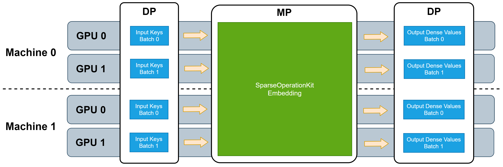

# SparseOperationKit #
SparseOperationKit (SOK) is a python package wrapped GPU accelerated operations dedicated for sparse training / inference cases. It is designed to be compatible with common DeepLearning (DL) frameworks, for instance, TensorFlow.

Most of the algorithm implementations in SOK are extracted from HugeCTR, which is a GPU-accelerated recommender framework designed to distribute training across multiple GPUs and nodes and estimate Click-Through Rates (CTRs). If you are looking for a very efficient solution for CTRs, please check [HugeCTR](https://github.com/NVIDIA/HugeCTR#readme).

## Features ##
**Model-Parallelism GPU Embedding Layer** <br>
In sparse training / inference scenarios, for instance, CTRs, there are very huge amount of parameters which is not fit into single GPU memory. And common DL frameworks does not support model-parallelism (MP). Therefore it is hard to fully utilize all available GPUs in a cluster to accelerate the whole training process. 

SOK provides **MP** functionality to fully utilize all avaiable GPUs, no matter these GPUs are located in single machine or multiple machines. Because most of DL frameworks have provided data-parallelism (DP), therefore SOK is designed to be compatible with DP training to minimize the code changes. With SOK embedding layers, one can build a DNN model with mixed MP and DP, where MP is for embedding parameters that is distributed among all available GPUs and DP is for other layers that only consume little GPU resources.

Several MP embedding layers are integrated into SOK. These embedding layers can leverage all available GPU memory to house embedding parameters, no matter in single machine or multiple machine. All the utilized GPUs work synchronously.

Due to SOK is compatible with DP training provided by common synchronized training frameworks, such as Horovod, TensorFlow Distribute Strategy, therefore the input data feeded to these embedding layers is in DP manner, and that means no further DP from/to MP transformation is needed when SOK is used to scale up your DNN model from single GPU to multiple GPUs. The following picture depicts the workflow of these embedding layers.


## Installation ##
Before building SOK, It is necessary to install NCCL and cmake additionally for docker image "registry.cn-shanghai.aliyuncs.com/pai-dlc-share/deeprec-training:deeprec-nightly-gpu-py36-cu110-ubuntu18.04". The way to install NCCL could refer to [install guide](https://docs.nvidia.com/deeplearning/nccl/install-guide/index.html). <br>
    
### *Install this module from pypi* ###
Install via `PYPI` will be supported in the near future.

### *Build from source* ### 
If you want to build this module from souce code, here are the steps to follow: <br>
+ **download the deeprec**
```shell
$ git clone https://github.com/alibaba/DeepRec.git DeepRec
```
+ **install to system path**
```shell
$ cd DeepRec/addons/sparse_operation_kit/
$ bash request.sh
$ mkdir -p build && cd build && cmake .. && make -j && make install
```

## Documents ##
Want to find more about SparseOperationKit, see our [SparseOperationKit documents](https://nvidia-merlin.github.io/HugeCTR/sparse_operation_kit/master/index.html).
