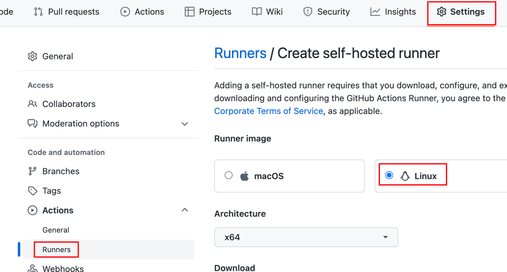
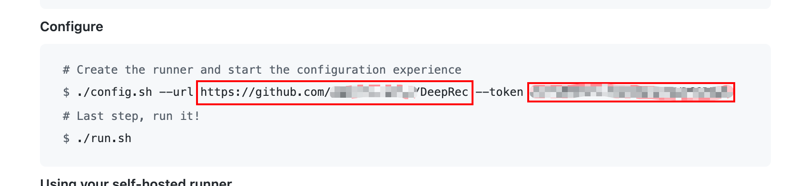

# DeepRec CICD GitHub Action self-host-runner Installation Guide

> We also provide the installation script(runner_setup.sh) ，which is located at 'cibuild' directory

1. Create new machine instance (ECS)，choose 'Ubuntu18.04 64bits' as OS. Please install Nvidia driver if your machine equips Nvidia GPU，and keep 80 and 443 port open in security group.
2. Install docker and self-host-runner in ECS.

   * Install docker

   ```bash
   apt-get update
   apt-get install -y ca-certificates curl gnupg lsb-release
   curl -fsSL https://download.docker.com/linux/ubuntu/gpg | sudo gpg --dearmor -o /usr/share/keyrings/docker-archive-keyring.gpg
   echo "deb [arch=$(dpkg --print-architecture) signed-by=/usr/share/keyrings/docker-archive-keyring.gpg] https://download.docker.com/linux/ubuntu $(lsb_release -cs) stable" | tee /etc/apt/sources.list.d/docker.list > /dev/null
   distribution=$(. /etc/os-release;echo $ID$VERSION_ID)
   curl -s -L https://nvidia.github.io/nvidia-docker/gpgkey | apt-key add -
   curl -s -L https://nvidia.github.io/nvidia-docker/$distribution/nvidia-docker.list | tee /etc/apt/sources.list.d/nvidia-docker.list
   apt-get update
   apt-get install -y docker-ce docker-ce-cli containerd.io nvidia-container-toolkit
   systemctl restart docker
   ```

   * Install self-host-runner

   ```bash
   # create user 'selfhost'，and add to docker group
   useradd -m -g "docker" -s "/bin/bash" selfhost
   # login selfhost user
   su -l selfhost
   # install self-host-runner, please refer to your github action runner installation guide page
   mkdir actions-runner && cd actions-runner
   curl -o actions-runner-linux-x64-2.288.1.tar.gz -L https://github.com/actions/runner/releases/download/v2.288.1/actions-runner-linux-x64-2.288.1.tar.gz
   tar xzf ./actions-runner-linux-x64-2.288.1.tar.gz
   ./config.sh --url <REPO_URL> --token <TOKEN>
   # set runner startup at boot and start runner now
   exit; cd /home/selfhost/actions-runner
   ./svc.sh install
   ./svc.sh start
   # check service status
   ./svc.sh status
   ```

   * setup cron task，delete the expired container and the old image periodically

   ```bash
   #!/bin/bash

   DOCKER_BIN=/usr/bin/docker
   LOG=/var/log/docker-cleanup.log

   echo "$(date) start----" >> $LOG

   # delete container created 5 hours ago, which is failed to release
   $DOCKER_BIN ps --no-trunc -a -q | while read cid
   do
       docker_create_time=$($DOCKER_BIN inspect -f '{{.Created}}' $cid | sed 's/\..*Z/Z/')
       standard_time=$(date -d 'now-5 hours' -Is --utc | sed 's/+00:00/Z/')
       if [ $docker_create_time \< $standard_time ]
       then
           echo "deleting container: " $cid
           $DOCKER_BIN stop $cid >> $LOG 2>&1
           $DOCKER_BIN rm $cid >> $LOG 2>&1
       fi
   done

   # delete old image
   $DOCKER_BIN images --format "{{.Repository}}:{{.Tag}}" | awk 'NR!=1{print $1}' | while read img_id
   do
       echo "deleting image: " $img_id
       $DOCKER_BIN rmi $img_id >> $LOG 2>&1
   done
   echo "$(date) end----" >> $LOG
   ```

    please upload the script above to '/root' and execute comand below

   ```bash
   echo "*/15 * * * * root flock -xn /tmp/cleanup.lock -c 'sh /root/cleanup.sh'" >> /etc/crontab
   ```

# runner_setup.sh

```bash
#!/bin/bash
set -e

if [ $# -ne 2 ]
then
        echo "Usage:\n\tsetup.sh REPO_URL TOKEN"
        exit; 
fi

REPO_URL=$1
TOKEN=$2

# install docker
echo "Installing docker"
apt-get update
apt-get install -y ca-certificates curl gnupg lsb-release
curl -fsSL https://download.docker.com/linux/ubuntu/gpg | sudo gpg --dearmor -o /usr/share/keyrings/docker-archive-keyring.gpg
echo "deb [arch=$(dpkg --print-architecture) signed-by=/usr/share/keyrings/docker-archive-keyring.gpg] https://download.docker.com/linux/ubuntu $(lsb_release -cs) stable" | tee /etc/apt/sources.list.d/docker.list > /dev/null
distribution=$(. /etc/os-release;echo $ID$VERSION_ID)
curl -s -L https://nvidia.github.io/nvidia-docker/gpgkey | apt-key add -
curl -s -L https://nvidia.github.io/nvidia-docker/$distribution/nvidia-docker.list | tee /etc/apt/sources.list.d/nvidia-docker.list
apt-get update
apt-get install -y docker-ce docker-ce-cli containerd.io nvidia-container-toolkit
systemctl restart docker

# create user 'selfhost'
echo "Creating selfhost user"
# create user 'selfhost'，and add to docker group
useradd -m -g "docker" -s "/bin/bash" selfhost || true

# Install self-host-runner
echo "Install self host runner program"
SELFHOST_HOME=/home/selfhost
sudo -u selfhost mkdir -p $SELFHOST_HOME/actions-runner && cd $SELFHOST_HOME/actions-runner
sudo -u selfhost curl -o actions-runner-linux-x64-2.288.1.tar.gz -L https://github.com/actions/runner/releases/download/v2.288.1/actions-runner-linux-x64-2.288.1.tar.gz
sudo -u selfhost tar xzf ./actions-runner-linux-x64-2.288.1.tar.gz
sudo -u selfhost ./config.sh --url $REPO_URL --token $TOKEN
 # set runner startup at boot and start runner now
cd $SELFHOST_HOME/actions-runner
./svc.sh install
./svc.sh start

echo "creating cron job"
echo -n "\
        #!/bin/bash

DOCKER_BIN=/usr/bin/docker
LOG=/var/log/docker-cleanup.log

echo \"\$(date) start----\" >> \$LOG

# delete container created 5 hours ago, which is failed to release
\$DOCKER_BIN ps --no-trunc -a -q | while read cid
do
    docker_create_time=\$(\$DOCKER_BIN inspect -f '{{.Created}}' \$cid | sed 's/\..*Z/Z/')
    standard_time=\$(date -d 'now-5 hours' -Is --utc | sed 's/+00:00/Z/')
    if [ \$docker_create_time \< \$standard_time ]
    then
        echo \"deleting container: \" \$cid
        \$DOCKER_BIN stop \$cid >> \$LOG 2>&1
        \$DOCKER_BIN rm \$cid >> \$LOG 2>&1
    fi
done

# delete old image
\$DOCKER_BIN images --format \"{{.Repository}}:{{.Tag}}\" | awk 'NR!=1{print \$1}' | while read img_id
do
echo \"deleting image: \" \$img_id
\$DOCKER_BIN rmi \$img_id >> \$LOG 2>&1
done
echo \"\$(date) end----\" >> \$LOG" > /root/cleanup.sh
echo "*/15 * * * * root flock -xn /tmp/cleanup.lock -c 'sh /root/cleanup.sh'" >> /etc/crontab
```

The script needs two parameters(repo name，token)，you can get it from github action runner installation guide page. The script will ask you to add a lable (such as cpu, gpu) to the runner， as for other option please keep default.


