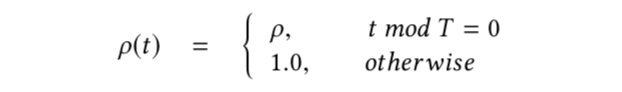

# AdagradDecay Optimizer
## 介绍
AdagradDecay是为支持超大规模训练而提出的一种改进版Adagrad优化器，实践证明，AdagradDecay在推荐、搜索场景下有很好的效果。超大规模模型除自身复杂外，一般隐含另外两个“大”：

1. 用于模型训练的样本很大，一般每次训练的样本量在10亿以上规模；
2. 模型持续增量训练的时间长，可达一个月以上（实践证明数据的累积对模型的效果有很大帮助）。

如此庞大的数据总量导致目前的Adagrad优化器无法适应。


Adagrad的原理：

$$
v_t=v_{t-1}+g_{t}^{2} \\
\\
\Delta w=\frac{\eta}{\sqrt{v_{t}+\epsilon}}g_{t}
$$


随着数据的累积，$v_t$会趋于无穷大，导致$\Delta w$趋近于0，也就是说新增的数据无法对模型产生影响。有研究将$v_t$的更新改进如下：

$$
v_t=\rho v_{t-1}+(1-\rho)g_{t}^{2}
$$

即每个iteration对累积量进行打折。这会解决$v_t$无穷大的问题，但也会导致模型效果变差。原因是对样本的使用不合理。

假设每天10亿样本，训练batch size为1000，所以一天的数据需要1000,000个iteration才能训练完成。假设$\rho =0.9999$，则第一个batch的样本在$v_t$中起的作用为$0.9999 ^{1000000}=3.7015207857933866e-44$，趋近于0，这是不合理的。

样本的作用应该由模型去学习，而不是靠人为规定的顺序和规则来影响模型。况且，考虑到样本产生的客观环境，第一个样本和后来的样本之间没有如此大的差别，显然按iteration去打折的策略是不合适的。

我们提出按采样周期打折的概念，同一个周期内的样本打折力度相同，兼顾数据无限累积和样本顺序对模型的影响。具体的，引入$\rho (t)$，定义如下：


对应的$v_t$为$v_t=\rho(t) v_{t-1}+g_{t}^{2}$

其中$T$为打折周期。实际中可以根据样本的产生规律和对模型的影响来设置，比如每天用户的购买行为可大致分为凌晨、上午、下午、晚上几个时间段，则打折周期可以设置成每天的$\frac{1}{4}$，既使得全部样本被训练完时，凌晨的部分被打折了$\rho^{4}$。


$T$对于稀疏特征的处理和稠密特征一样，是全局的$T$，而不是稀疏特征出现的次数，这样做的目的是希望加速稀疏特征的学习。

打折不会是无限制的，为了避免因打折导致的$v_t$过小问题，我们引入了保护措施，即$v_t$有下限保护。
​

## 接口介绍
训练时只需要定义`tf.train.AdagradDecayOptimizer`即可，和其他TF原生Optimizer使用方式相同。具体定义如下：
```python
class AdagradDecayOptimizer(optimizer.Optimizer):
  """Optimizer that implements the Adagrad algorithm with accumulator decay.
  Different from the original Adagrad algorithm, AdagradDecay performs decay
  at given step with given rate. So that the accumulator will not be infinity.
  """

  def __init__(self, 
               learning_rate, 
               global_step,
               initial_accumulator_value=0.1,
               accumulator_decay_step=100000,
               accumulator_decay_rate=0.9,
               use_locking=False,
               name="AdagradDecay"):
    """Construct a new AdagradDecay optimizer.

    Args:
      learning_rate: A `Tensor` or a floating point value.  The learning rate.
      global_step: global step variable, used for calculating t%T .
      initial_accumulator_value: A floating point value. Starting and baseline
        value for the accumulators, must be positive. The accumulators will not 
        be less than it. 
      accumulator_decay_step: When global_step reaches times of 
        accumulator_decay_step, accumulator will be decayed with        
        accumulator_decay_rate. accumulator *= accumulator_decay_rate
      accumulator_decay_rate: Decay rate as above described.
      use_locking: If `True` use locks for update operations.
      name: Optional name prefix for the operations created when applying
        gradients.  Defaults to "AdagradDecay".

    Raises:
      ValueError: If the `initial_accumulator_value`, `accumulator_decay_step`
        or `accumulator_decay_rate` is invalid.
    """
```


## 使用示例
```python
import tensorflow as tf

var = tf.get_variable("var_0", shape=[10,16],
                       initializer=tf.ones_initializer(tf.float32))

emb = tf.nn.embedding_lookup(var, tf.cast([0,1,2,5,6,7], tf.int64))
fun = tf.multiply(emb, 2.0, name='multiply')
loss = tf.reduce_sum(fun, name='reduce_sum')

gs= tf.train.get_or_create_global_step()
opt = tf.train.AdagradDecayOptimizer(0.1, global_step=gs)

g_v = opt.compute_gradients(loss)
train_op = opt.apply_gradients(g_v)

init = tf.global_variables_initializer()

sess_config = tf.ConfigProto(allow_soft_placement=True, log_device_placement=False)
with tf.Session(config=sess_config) as sess:
  sess.run([init])
  print(sess.run([emb, train_op, loss]))
  print(sess.run([emb, train_op, loss]))
  print(sess.run([emb, train_op, loss]))
```
