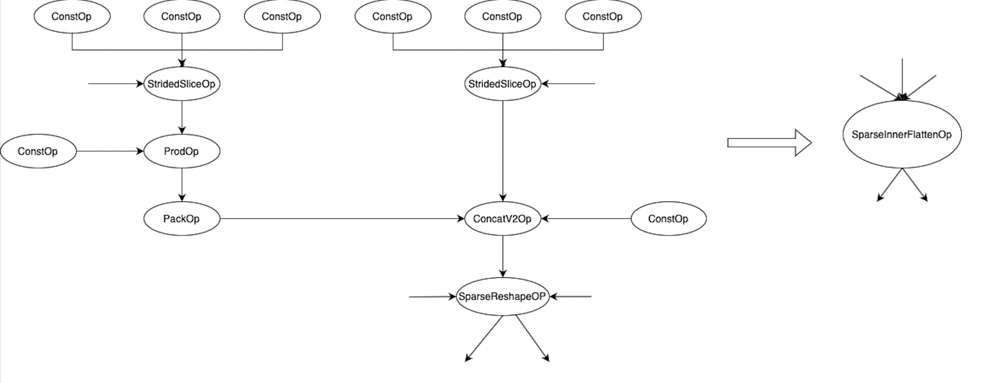
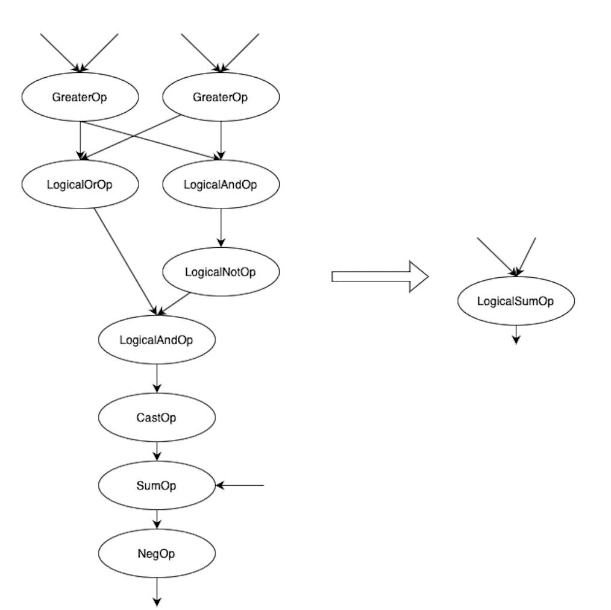
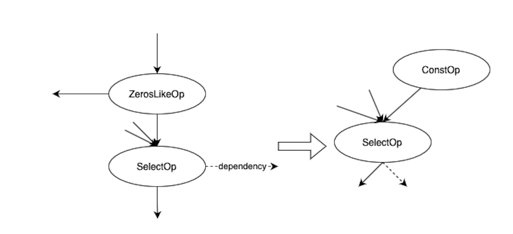
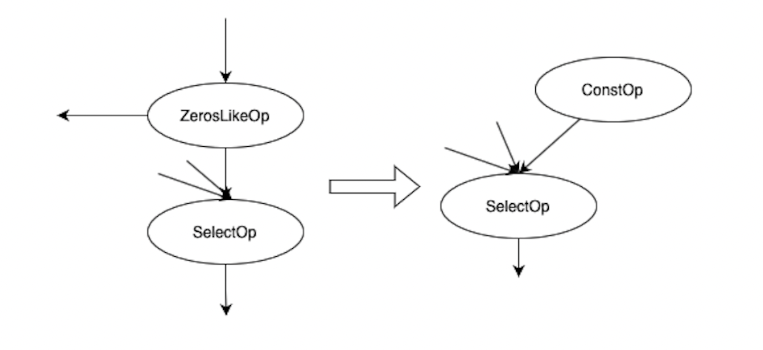
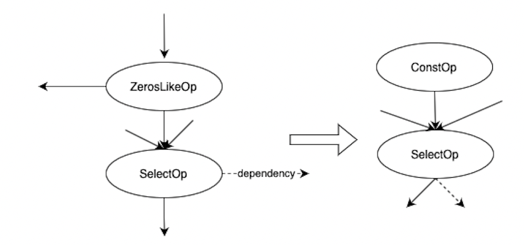
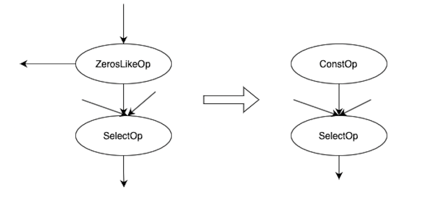
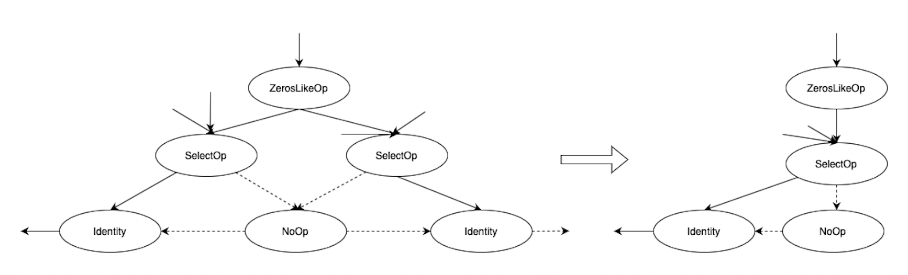
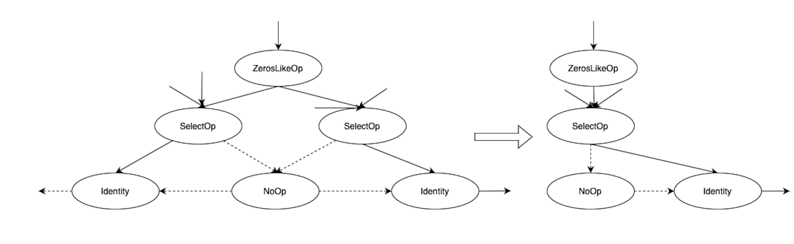

# Auto Graph Fusion用户文档
## 功能介绍
DeepRec中提供了AutoGraphFusion功能，该功能提供了内置的一组子图匹配模版（子图->Macro Op)，当用户图中存在某个模版的匹配，在图优化阶段会自动替换该模版对应的Macro Op。该功能正在不断完善中，会增加更多的子图模版及对应的Macro Op实现。通过该功能，能够一方面避免对用户代码的修改，自动实现调用Macro Op的能力；另一方面方面也能够提高某些跨高层接口子图的优化能力。
​

Auto Graph Fusion主要包含两部分功能：

1. 透明地将满足特定Pattern的Op组合替换为等价的Macro Op，通过替换成Macro Op的方式可以节约调度与访存开销
1. 为了解决大量小Op执行中调度开销占比高导致整个图执行效率低的问题，通过使用Op合并将大量小Op以合理的粒度的自动替换为合并Op，以减少调度小Op的开销问题。
## 使用方法
通过session config中的do_op_fusion开关控制Auto Op Fusion功能的打开与关闭
```python
config = tf.ConfigProto()
config.graph_options.optimizer_options.do_op_fusion = True
with tf.Session(config=config) as sess:
  ...
```
## 可优化子图
目前支持以下几种子图的优化：
1.

2.

3. 
3. 
3. 
3. 
3. 
3. 


