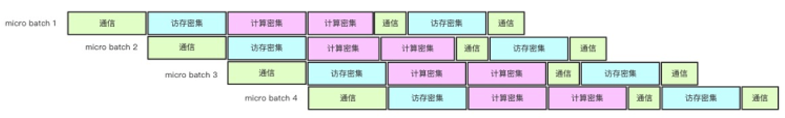

# Auto Micro Batch
## 功能介绍
该设计参考了GPipe的设计思路。在Gpipe里面，由于需要支持大模型因此需要引入模型并行，因此需要将大模型跨device进行切割（cut）和放置（place）。在普通的模型并行的方式里面，会存在由于模型切割之后的两部分子图sequential运行从而导致无法充分跑满GPU的问题。因此，在Gpipe和Pipedream这两个论文里，分别引入了Pipeline的思路，同时Pipedream对前后向进行了仔细的调度从而可以保证相应显存可以得以明显的下降从而可以增加batch size。


我们在图优化阶段，自动识别复制子图并且生成聚合子图，自动将用户的子图复制N份，N个MicroBatch Size（N个Micro batch size之和等同于单个mini batch）同时训练，多个MicroBatch对梯度进行累加后更新至variable，因此不会对训练收敛性产生影响。
​


## 使用方法
AutoMicroBatch功能依赖于用户开启图优化的选项，需要注意的是，如果用户配置batch_size=1024，配置micro_batch_num=2，那么实际等价于用户之前使用batch_size=2048训练的收敛性。如果用户使用前的batch_size=512，使用large_batch_size功能配置micro_batch_num=4，那么在不改变收敛性的情况下，建议用户同时修改batch_size=128，用户接口如下:


```cpp
config = tf.ConfigProto()
config.graph_options.optimizer_options.micro_batch_num = 4
```
## 性能对比

DeepCTR模型单机版测试效果：

不开启Pipeline，对比组试验

|                                | 单轮耗时 ms | 吞吐提升 |
| :------------------------------: | :---------: | :--------: |
| batch_size = 256,  no pipeline |     293     | -        |

开启Pipeline，2路Pipeline

|                                   | 单轮耗时 ms | 吞吐提升 |
| :---------------------------------: | :---------: | :--------: |
| batch_size/pipe = 128，2 pipeline |     220     | +30%     |
| batch_size/pipe = 256，2 pipeline |     503     | +17%     |

开启Pipeline，4路Pipeline

|                                   | 单轮耗时 ms | 吞吐提升 |
| :---------------------------------: | :---------: | :--------: |
| batch_size/pipe = 64，4 pipeline  |     250     | +17%     |
| batch_size/pipe = 256，4 pipeline |    1108     | +8%      |


