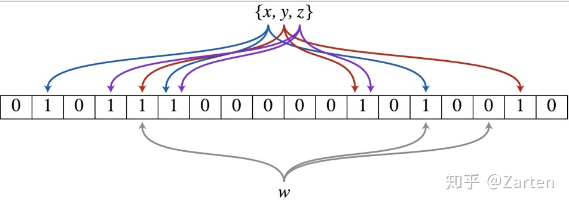
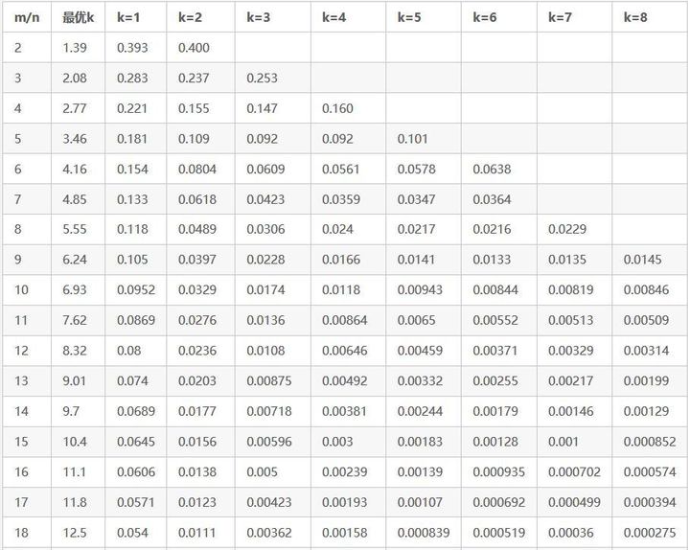

# 基于Bloom Filter的特征准入
## Bloom Filter介绍
布隆过滤器实际上是由一个超长的二进制位数组和一系列的哈希函数组成。二进制位数组初始全部为0，当给定一个待查询的元素时，这个元素会被一系列哈希函数计算映射出一系列的值，所有的值在位数组的偏移量处置为1。

如下图所示：

如何判断某个元素是否在这个集合中呢？
同样是这个元素经过哈希函数计算后得到所有的偏移位置，若这些位置全都为1，则判断这个元素在这个集合中，若有一个不为1，则判断这个元素不在这个集合中。

Bloom Filter的优点包括：
  1. 可以在O(1)时间内判断一个元素是否属于一个集合
        2. 不会出现漏判 （属于该集合的一定可以判断出来）

缺点包括:

  1. 可能会出现误判（不属于该集合的可能会被误判为属于该集合）

## 基于Bloom Filter的特征准入功能
### 原理
而我们的特征准入功能是CBF (Counting Bloom Filter)实现的，CBF相比于基础的Bloom filter的不同之处在于它将比特位替换成了counter，因此拥有计数的功能，因此可以判断用于判断是否特征的频次是否已经超过某一阈值。
### 参数设置
主要设置的参数有四个：特征的数量 n、 hash函数的数量 k、以及counter的数量m、允许的错误率p。

这四个参数的关系可以参考下表：


另外，当用户给定错误率p时以及特征数量n时，m和k可以通过如下计算得到：

$$
m = -\frac{n\ln_{}{p}}{(\ln_{}{2})^2 } \\
\\
k = \frac{m}{n}\ln_{}{2}
$$
### 使用方法
```python
evconfig = variables.EVConfig( bloom_filter_strategy = variables.BloomFilterStrategy(
                                                          filter_freq=3,
                                                          max_element_size = 2**30,
                                                          false_positive_probability = 0.01,
                                                          counter_type=dtypes.uint64))
embedding = tf.get_embedding_variable("var_dist",
                                       embedding_dim=6,
                                       initializer=tf.ones_initializer,
                                       ev=evconfig)
```

用户首先构造`BloomFilterStrategy`对象，配置最大的特征的数量、可接受的错误率以及存储frequency的数据类型。之后将该对象传入到`EVConfig`的构造函数并配置`filter_freq`即可。该功能默认关闭。
在save ckpt的时候不会记录特征对应的频次，即没有达到准入标准的特征在restore ckpt后会从0开始计数。

**下面是一个使用示例：**

```python
import tensorflow as tf
import tensorflow
import time
import random
from tensorflow.python.framework import ops
from tensorflow.python.ops import variables
from tensorflow.python.client import timeline
from tensorflow.python.lib.io import file_io
from tensorflow.python.ops import math_ops
from tensorflow.python.framework import dtypes
from tensorflow.python.training import saver as saver_module
from tensorflow.python.training import incremental_saver as incr_saver_module 
from tensorflow.python.training import training_util
from tensorflow.contrib.framework.python.framework import checkpoint_utils
import numpy as np

def main(unused_argv):
    evconfig = variables.EVConfig( filter_freq=3,
                                  bloom_filter_strategy = variables.BloomFilterStrategy(
                                                            max_element_size = 2**30,
                                                            false_positive_probability = 0.01),
                                  evict=evictconfig)
    embedding = tf.get_embedding_variable("var_dist",
                                          embedding_dim=6,
                                          initializer=tf.ones_initializer,
                                          ev=evconfig)
    ids = math_ops.cast([1,1,1,1,2,2,2,3,3,4], dtypes.int64)
    values = tf.nn.embedding_lookup(embedding, ids)
    fun = math_ops.multiply(values, 2.0, name='multiply')
    gs = training_util.get_or_create_global_step()
    loss1 = math_ops.reduce_sum(fun, name='reduce_sum')
    opt = tf.train.AdagradOptimizer(0.1)
    g_v = opt.compute_gradients(loss1)
    train_op = opt.apply_gradients(g_v)
    
    init = variables.global_variables_initializer()
    with tf.Session(config=config) as sess:
        sess.run([init])
        print(sess.run([values, train_op]))
        
 
if __name__=="__main__":
    tf.app.run()
```
