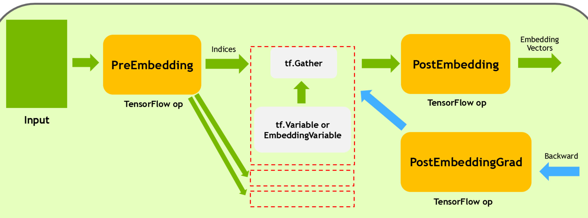

# Embedding子图Fusion用户文档

## 介绍

DeepRec 及 TensorFlow 原生的 embedding lookup 相关 API，如 safe_embedding_lookup_sparse，会创建比较多的 op，因此在 GPU 上执行时容易出现 kernel launch bound 的问题。因此，Embedding子图Fusion功能提供了一组接口，并提供了一组fusion ops，通过Fusion的Op，减少需要 launch 的 kernel 数量，并提供高性能的实现，达到在 GPU 上加速执行的目的。
## FeatureColumn接口
用户 FeatureColumn作为接口。embedding_column 会返回一个 EmbeddingColumn 的类实例，常用的 EmbeddingColumn 有：

1. `tensorflow/python/feature_column/feature_column_v2.py` 的 `EmbeddingColumn` 
1. `tensorflow/contrib/layers/python/layers/feature_column.py` 的 `_EmbeddingColumn`

然后一般会通过 `tf.feature_column.input_layer` 或 `tf.feature_column_ops.input_from_feature_columns` 等高级接口，将此实例传入，建立 lookup 相关计算图。
因此，Embedding子图Fusion功能给上述的 `EmbeddingColumn` 类都添加了 `do_fusion` 属性，默认为 `False`，用户在使用时，可以显示的设置为 `True`，让 embedding lookup 过程使用 fused ops。
如下：

```python
import tensorflow as tf
from tensorflow.python.framework import ops


columns = tf.feature_column.categorical_column_with_embedding("col_emb", dtype=tf.dtypes.int64)
W = tf.feature_column.embedding_column(categorical_column=columns,
            dimension=3,
            initializer=tf.ones_initializer(tf.dtypes.float32),
            do_fusion=True)

ids={}
ids["col_emb"] = tf.SparseTensor(indices=[[0,0],[1,1],[2,2],[3,3],[4,4]], values=tf.cast([1,2,3,4,5], tf.dtypes.int64), dense_shape=[5, 4])

# 传入设置了 use_fused_lookup 的 EmbeddingColumn 实例
emb = tf.feature_column.input_layer(ids, [W])
fun = tf.multiply(emb, 2.0, name='multiply')
loss = tf.reduce_sum(fun, name='reduce_sum')
opt = tf.train.FtrlOptimizer(0.1, l1_regularization_strength=2.0, l2_regularization_strength=0.00001)
g_v = opt.compute_gradients(loss)
train_op = opt.apply_gradients(g_v)
init = tf.global_variables_initializer()

with tf.Session() as sess:
    sess.run(init)
    print("init global done")
    print(sess.run([emb, train_op,loss]))
    print(sess.run([emb, train_op,loss]))
    print(sess.run([emb, train_op,loss]))
```
```python
import tensorflow as tf
from tensorflow.python.framework import ops
from tensorflow.contrib.layers.python.layers import feature_column_ops
from tensorflow.contrib.layers.python.layers import feature_column


columns = feature_column.sparse_column_with_embedding(column_name="col_emb", dtype=tf.dtypes.int64)
W = feature_column.embedding_column(sparse_id_column=columns,
            dimension=3,
            initializer=tf.ones_initializer(tf.dtypes.float32),
            do_fusion=True)


ids={}
ids["col_emb"] = tf.SparseTensor(indices=[[0,0],[1,1],[2,2],[3,3],[4,4]], values=tf.cast([1,2,3,4,5], tf.dtypes.int64), dense_shape=[5, 4])

# 传入设置了 do_fusion 的 EmbeddingColumn 实例
emb = feature_column_ops.input_from_feature_columns(columns_to_tensors=ids, feature_columns=[W])
fun = tf.multiply(emb, 2.0, name='multiply')
loss = tf.reduce_sum(fun, name='reduce_sum')
opt = tf.train.FtrlOptimizer(0.1, l1_regularization_strength=2.0, l2_regularization_strength=0.00001)
g_v = opt.compute_gradients(loss)
train_op = opt.apply_gradients(g_v)
init = tf.global_variables_initializer()

with tf.Session() as sess:
    sess.run(init)
    print("init global done")
    print(sess.run([emb, train_op,loss]))
    print(sess.run([emb, train_op,loss]))
    print(sess.run([emb, train_op,loss]))
```
## fused_safe_embedding_lookup_sparse接口
通过 `tf.contrib.layers.python.layers.embedding_ops` 或 `tf.python.ops.embedding_ops` 中的 `fused_safe_embedding_lookup_sparse`
```python
def fused_safe_embedding_lookup_sparse(embedding_weights,
                                       sparse_ids,
                                       sparse_weights=None,
                                       combiner="mean",
                                       default_id=None,
                                       name=None,
                                       partition_strategy="div",
                                       max_norm=None,
                                       prune=True):
```
此接口与 DeepRec 的 `safe_embedding_lookup_sparse` 接口功能是一致的。因此参数不再赘述，可查看相关文档
## fused_embedding_lookup_sparse接口
通过 `nn.fused_embedding_lookup_sparse`
```python
def fused_embedding_lookup_sparse(params,
                                  sp_ids,
                                  sparse_weights=None,
                                  partition_strategy=None,
                                  name=None,
                                  combiner=None,
                                  max_norm=None,
                                  default_id=None,
                                  prune_invalid_ids=False,
                                  blocknums=None):
```

- `params`: List，可以含有单个的 embedding tensor 或是被 partition 过的 embedding tensors。embedding tensors 的 rank 须都为 2。
- `sp_ids`: SparseTenor，其 values 为需要查找的 id。indices 的 rank 须为 2。dense_shape 的 rank 须为 1，元素个数为 2。
- `sparse_weights`: sparse_ids 的 values 的权重。
- `partition_strategy`: embedding tensor 的 partition 策略。
- `name`: 此 operation 的名称。
- `combiner`: entry 维度进行 combine 的策略。
- `max_norm`: 如果不为 None, 则对每个 embedding vector 都计算 l2，然后对于超过 max_norm 值的进行 normalization。
- `default_id`: 对于 empty 的 row，填充 default_id。如果 default_id 为 None, 则默认填充 0。
- `prune_invalid_ids`: 是否对 sparse_ids 去除非法值(id < 0)。
- `blocknums`: DynamicEmbeddingVariable 使用的参数。
## 注意事项

1. 目前 Embedding子图Fusion当前支持 Nvidia GPU 上执行。相应的 `tf.Variable` 和 `EmbeddingVariable` 及其他算子可以在 CPU 上。其中CPU版本的Embedding Fusion子图功能正在代码开发中。
1. 目前不支持设置权重 `sparse_weights`。
1. partition_strategy 目前只支持 div ，且在 axis = 0 上对 embedding tensor 做切分。且如果 embedding tensor 是 EmbeddingVariable 的话，目前只能是单个完整的 ev，还不支持对 ev 进行 partition 的查找模式。
1. 目前不支持动态弹性维度、Multi-Hash Variable、AdaptiveEmbedding功能，后续会逐步支持。
## Op 介绍及计算图
新增了 Fused Embedding 相关算子:

1. FusedEmbeddingSparsePreLookUp
2. FusedEmbeddingSparsePostLookUp
3. FusedEmbeddingSparsePostLookUpGrad


以底层级接口 `fused_embedding_lookup_sparse` 为例，调用之后会创建如下的计算图：


1. **FusedEmbeddingSparsePreLookUp** 主要负责 fill empty row, prune invalid id, 以及根据 partition_strategy 对 sp_ids 的 values 和 indices 进行划分。

2. **tf.Gather** 与 **EmbeddingVariable** 或 **tf.Variable** 在同一个 device 上，在 partition 的情况下可能有多份，在不同的 device 上(分布式)。它负责接受 PreEmbedding 划分过的 values 和 indices，进行实际的 embedding vector 查找。

3. **FusedEmbeddingSparsePostLookUp** 则负责将 embedding vector 从各个 parition 上收集回来，然后进行 combiner 及 max_norm 等相关操作。

4. **FusedEmbeddingSparsePostLookUpGrad** 负责 FusedEmbeddingSparsePostLookUp 的反向梯度计算。

## 性能对比
在 modelzoo 中，对比了一些 model 在 unfused 以及 fused embedding 情况下性能提升（5000个 iteration 平均结果）

Machine:
8 cores AMD EPYC 7232P CPU @ 3.20GHz.

A100-80GB-PCIE GPU

DLRM Model:

|         | Avg Time per Iteration |
| ------- | ---------------------- |
| Unfused | 20.78 ms               |
| Fused   | 17.41 ms               |
| SpeedUp | 1.19x                  |

DeepFM Model:

|         | Avg Time per Iteration |
| ------- | ---------------------- |
| Unfused | 37.24 ms               |
| Fused   | 30.98 ms               |
| SpeedUp | 1.20x                  |

WDL Model:

|         | Avg Time per Iteration |
| ------- | ---------------------- |
| Unfused | 36.38 ms               |
| Fused   | 34.52 ms               |
| SpeedUp | 1.05x                  |
