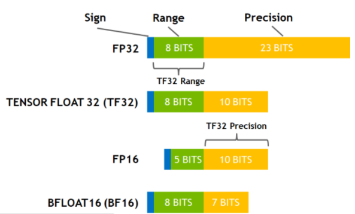
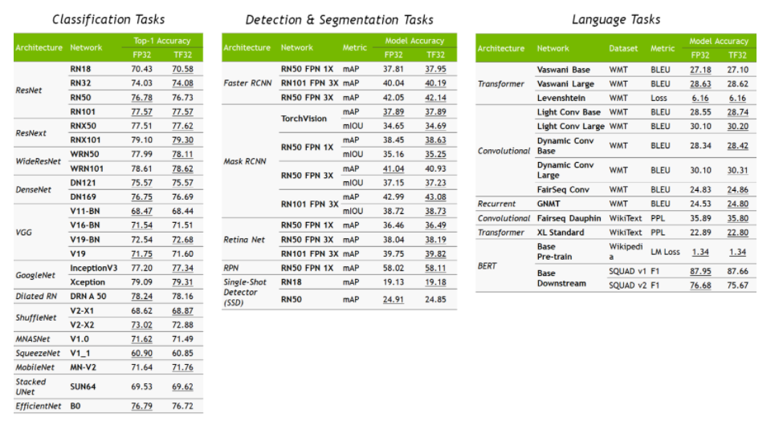

# NVIDIA TF32
## TF32 简介
TensorFloat-32，是 Nvidia 在 Ampere 架构的 GPU 上推出的专门运用于 TensorCore 的一种计算格式。其与其他常用数据格式的比较：



在 A100 上，使用 TF32 进行矩阵乘法运算可以比 V100 上使用 FP32 CUDA Core 运算提升 8x 的速度。
请注意，TF32 仅仅是在使用 TensorCore 时的一种中间计算格式，它并不是一个完全的数据类型。
​

## 使用方法及条件
前置条件：

1. 矩阵乘法及卷积相关运算，且输入数据类型为 FP32，才可以使用 TF32 作为 TensorCore 的中间计算类型。
1. Ampere 架构的 GPU


通常情况下使用 TF32，都是由 cuBlas，cuDNN 等 Nvidia 的计算库来在内部进行调用的。因此无论您上层的深度学习框架使用的是什么，请确保：

1.  cuBLAS >= 11.0
1. cuDNN >= 8.0


在 Ampere 架构的 GPU 上，默认启用了 TF32 来进行计算加速。但是并不是每一个矩阵及卷积计算都一定会使用 TF32，跟输入数据类型，输入的形状等因素都有一定的关系。TF32 会尽可能的在合适的时候被使用。
如果想强制关闭 TF32，可以通过设置环境变量：
```bash
export NVIDIA_TF32_OVERRIDE=0
```
来命令所有的 Nvidia 计算库关闭 TF32。
​

## TF32 对精度影响
Nvidia 对比了 FP32 与 TF32 情况下，各个知名模型的精度差异，TF32 对精度基本无影响：


## 更多信息

1. [https://developer.nvidia.com/blog/accelerating-ai-training-with-tf32-tensor-cores/](https://developer.nvidia.com/blog/accelerating-ai-training-with-tf32-tensor-cores/)
1. [https://blogs.nvidia.com/blog/2020/05/14/tensorfloat-32-precision-format/](https://blogs.nvidia.com/blog/2020/05/14/tensorfloat-32-precision-format/)
