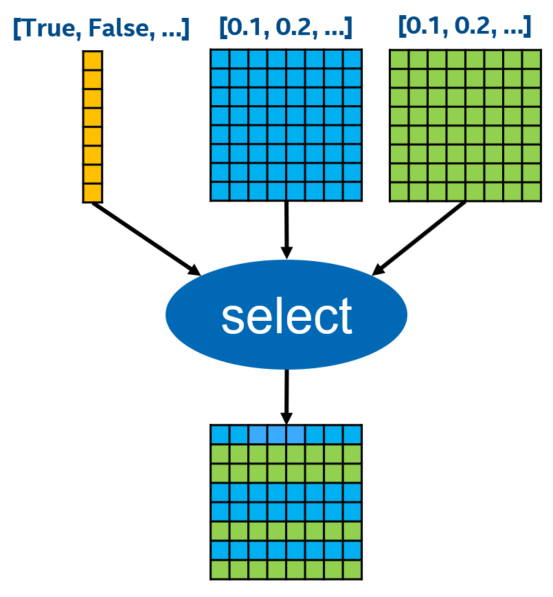

# 算子优化


## 硬件和软件配置

Hardware: [Alibaba Cloud ECS general purpose instance family with high clock speeds - **ecs.hfg7.2xlarge**](https://help.aliyun.com/document_detail/25378.html?spm=5176.2020520101.vmBInfo.instanceType.4a944df5PvCcED#hfg7).

CPU number: 8 cores

Baseline version:  Tensorflow v1.15.5

Optimized version: DeepRec

Gcc version 7.5.0


## 性能数据

| Op Name | Input Tensor Shape | Baseline Perf (latency/ms) | Optimized Perf (latency/ms) | Speedup |
| --- | --- | --- | --- | --- |
| Select | condition: (1024, 64), x: (1024, 64), y: (1024, 64) | 2.080 | 0.564 | +3.68X |
| Dynamic_stitch | indices: (40, 2500), data: (40, 2500, 64) | 82.14 | 24.77 | +3.31X |
| Transpose	| data: (1024, 64) | 1.504 | 0.366 | +4.11X |
| Tile | input: (512, 50), multiples: (2, 50) | 1.68 | 0.125 | +13.44X |
| BiasAddGrad | data: (51200, 512) | 26.84 | 1.67 | +16.07X |
| SparseSegmentMean | data: (51200, 128), indices: (51200), seg index: (51200) | 1.93 | 0.445 | +4.34X |
| Unique |  |  |  |  |
| Gather |  |  |  |  |
| BiasAdd |  |  |  |  |
| where |  |  |  |  |
| DynamicPartition |  |  |  |  |
| SparseConcat |  |  |  |  |

## 案例解析：Select

Select 算子的计算过程：



TensorFlow 原版实现：Broadcast + Elementwise Select

```C++
template <typename Device, typename T, int NDIMS>
struct BCastSelectFunctorBase {
  void operator()(const Device& d,
                  typename TTypes<T, NDIMS>::Tensor output_tensor,
                  typename TTypes<bool, NDIMS>::ConstTensor cond_tensor,
                  typename TTypes<T, NDIMS>::ConstTensor then_tensor,
                  typename TTypes<T, NDIMS>::ConstTensor else_tensor,
                  typename Eigen::array<Eigen::DenseIndex, NDIMS> cond_bcast,
                  typename Eigen::array<Eigen::DenseIndex, NDIMS> then_bcast,
                  typename Eigen::array<Eigen::DenseIndex, NDIMS> else_bcast) {
    output_tensor.device(d) = cond_tensor.broadcast(cond_bcast)
                                  .select(then_tensor.broadcast(then_bcast),
                                          else_tensor.broadcast(else_bcast));
  }
};
```

PAI-TF (Merge回社区)：Row Select，优化 TensorFlow 原版多余的 broadcast 操作。

```C++
    if (c[i]) {
        for (size_t j = 0; j < batch_size; ++j) {
        output[offset + j] = t[offset + j];
        }
    } else {
        for (size_t j = 0; j < batch_size; ++j) {
        output[offset + j] = e[offset + j];
        }
    }
```

DeepRec: 向量化 Row Select，采用 AVX512 mask 向量化指令进一步优化 select 操作，提升单个算子性能 3.68 倍。

```C++
    __mmask16 cmask = (c[i] == false) ? 0xffff : 0x0000;  // select t/e
    size_t ofs = 0;

    for (size_t j = 0; j < quotient; ++j) {
        __m512 src = _mm512_loadu_ps(t + offset + ofs);
        __m512 tmp = _mm512_mask_loadu_ps(src, cmask, e + offset + ofs);
        _mm512_storeu_ps(output + offset + ofs,  tmp);
        ofs +=  float_alignment;
    }

    if (remainder != 0) {
        __mmask16 mask = (remainder >= float_alignment)
            ? 0xffff : 0xffff >> (float_alignment - remainder);
        cmask &= mask;
        __m512 src  = _mm512_mask_loadu_ps(_mm512_setzero_ps(), mask, t + offset + ofs);
        __m512 tmp = _mm512_mask_loadu_ps(src, cmask, e + offset + ofs);
        _mm512_mask_storeu_ps(output + offset + ofs, mask, tmp);
    }
```