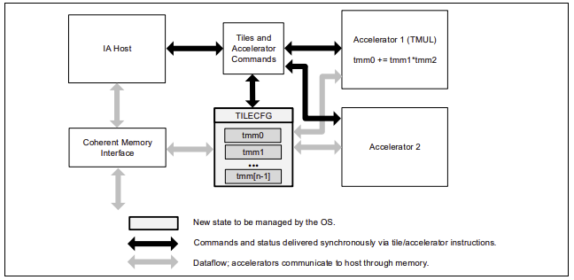

# Intel® AMX

Intel® Advanced Matrix Extensions (Intel® AMX) is the new acclerating technology for Deep Learning, which is supported on the fourth-generation Intel® Xeon® Scalable processor Sappire Rapids [AliCloud g8i specification family](https://help.aliyun.com/document_detail/25378.html#g8i) . It supports two datatypes, BFloat16 and Int8. The details about BFloat16 usage, please refer to [Bfloat16](BFloat16.md).

Intel® Advanced Matrix Extensions (Intel® AMX) is a new 64-bit programming paradigm consisting of two components: a set of 2-dimensional registers (tiles) representing sub-arrays from a larger 2-dimensional memory image and an accelerator able to operate on tiles. The first implementation is called TMUL (tile matrix multiply unit). Below shows the AMX architecture. 



## Requirements and Methods

#### Requirements：
The cloud instance requires to be the fourth-generation Intel® Xeon® Scalable processor Sappire Rapids [AliCloud g8i specification family](https://help.aliyun.com/document_detail/25378.html#g8i). It also requires to use DeepRec which is compiled and optimized by oneDNN in order to provide AMX instruction acceleration, details of which can be found in the oneDNN section. Except for that, there are other software requirements:
- OS or Kernel version： The kernel should be 5.16+. Both of Anolis OS and Ubuntu2204 support AMX.
- Python Version：If python is used, the version should be python3.8+. If C++ is used, then it's fine. 

#### Methods：
As the recommendation scenarios are extremely demanding in terms of model accuracy, in order to improve model performance while taking into account model accuracy, AMX BFloat16 can be used in recommendation system. There are two methods to make use of AMX. 

##### Enable AMX by the special BFloat16 API（Only for training）
The details are described in [Bfloat16](BFloat16.md) section. The advantage is that, developers can decide which graph will run in BF16 and which graph will keep FP32 in order to meet the accuracy requirement. And the introduced cast overhead can be minimized by operator fusion to achieve the better performance. But if users want to get benefit from AMX more easier, they can try the second method as below.

##### Enable AMX by setting the runtime environment `ONEDNN_DEFAULT_FPMATH_MODE=bf16`(For both training and inference)
The method is supported by the oneDNN library without requiring any code modification from the user. It automatically recognizes matrix multiplication and accelerates computation using the AMX BF16 instruction set. It is very convenient to use, but the performance and precision may be slightly inferior to the first method. The specific effects depend on the actual model.
```
export ONEDNN_DEFAULT_FPMATH_MODE=bf16
```

Besides, users can confirm whether AMX is working by setting the `ONEDNN_VERBOSE` environment variable. If it is working, keywords such as 'AMX' will be printed as output.
```
export ONEDNN_VERBOSE=1
```
## Performance Comparison

The following provides the AMX performance data comparison by using BFloat16 API to freely control the computational graph.

Use models in DeepRec Modelzoo to compare the DeepRec with BF16 and FP32 to see the performance improvement. Models in Modelzoo can enable the BF16 feature by adding `--bf16` parameter.

Use Aliyun ECS cloud server as benchmark machine, Intel 4th Xeon Scalable Processor(Sappire Rapids) specification [AliCloud g8i specification family](https://help.aliyun.com/document_detail/25378.html#g8i)

- Hardware configuration：
  - Intel(R) Xeon(R) Platinum 8475B
  - CPU(s): 16
  - Socket(s): 1
  - Core(s) per socket: 8
  - Thread(s) per core: 2
  - Memory: 64G
  

- Software configuration：
  - kernel: Linux version 5.15.0-58-generic 
  - OS: Ubuntu 22.04.2 LTS
  - GCC: 11.3.0
  - Docker: 20.10.21
  - Python: 3.8

Performance Result：

| **Throughput** | **WDL**  | **MMoE** | **DSSM**  |
|----------------|----------|------------|-----------|
| FP32           | 33605.22 | 69538.47    | 102072.3 |
| FP32+BF16      | 85801.28  | 155582   | 209099.7 |
| Speedup        | 2.55x    | 2.24x      | 2.05x     |

BF16 has little effect on the AUC metric of model training, more details of the difference can be found in the documentation of each model in the model zoo.

