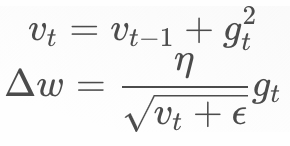
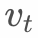
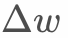
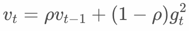
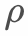
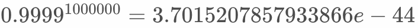
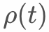
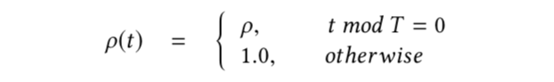
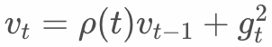
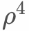

# AdagradDecay Optimizer

## Introduction

AdagradDecay optimizer is an improved version of the Adagrad optimizer proposed to support ultra-large-scale training and has a good effect in recommendation and search scenarios.

In addition to its complexity, the ultra-large-scale model generally has the following characteristics:

1. model training needs a huge amount of samples, each training needs more than 1 billion samples.

2. The continuous incremental training of the model takes a long time, up to more than one month. (Practice has proved that the accumulation of data can improve the effectiveness of the model).

The current Adagrad optimizer cannot cope with such huge data.

## The principle of Adagrad



With the accumulation of data,  will tend to infinity, causing  to approach 0, which means that new data cannot affect the model.

Some studies have improved the update method of  as follows：



That is, the cumulant is discounted at each iteration. This will solve the problem of  going to infinity, but it will also cause the model to perform poorly. The reason is the inappropriate use of samples.

Assuming 1 billion samples per day, the training batch size is 1000, so one day's data needs 1000,000 iterations to complete the training. Assuming  = 0.9999， the sample of the first batch has an effect of , closes to 0, which is unreasonable.

The effect of the sample should be learned by the model, rather than relying on the artificial order and rules. Moreover, considering the objective environment in which the samples were produced, there is not such a large difference between the first sample and the subsequent samples, so the strategy of discounting by iteration is not appropriate.

We propose the concept of discounting according to the sampling period. The sample discount in the same period is the same, taking into account the infinite accumulation of data and the impact of sample order on the model.  is defined as follows:



so, .

Where T is the discount period. In practice, it can be set according to the pattern of sample generation and the impact on the model. For example, the daily purchase behavior of users can be roughly divided into several periods: early morning, morning, afternoon, and evening. The discount period can be set to 1/4 of each day. When all samples are trained, the part in the early morning is only discounted by .

T handles sparse features in the same way as dense features, it is global T, not the number of times sparse features appear. The purpose of this is to speed up the model's learning of sparse features.

The discount will not be unlimited. In order to avoid the problem that  is too small due to the discount, we have introduced protection measures, that is,  has a lower limit protection.

## User API

Users only need to define `tf.train.AdagradDecayOptimizer` during training, which is the same as other TF native optimizers.

```python
class AdagradDecayOptimizer(optimizer.Optimizer):
  """Optimizer that implements the Adagrad algorithm with accumulator decay.
  Different from the original Adagrad algorithm, AdagradDecay performs decay
  at given step with given rate. So that the accumulator will not be infinity.
  """

  def __init__(self, 
               learning_rate, 
               global_step,
               initial_accumulator_value=0.1,
               accumulator_decay_step=100000,
               accumulator_decay_rate=0.9,
               use_locking=False,
               name="AdagradDecay"):
    """Construct a new AdagradDecay optimizer.

    Args:
      learning_rate: A `Tensor` or a floating point value.  The learning rate.
      global_step: global step variable, used for calculating t%T .
      initial_accumulator_value: A floating point value. Starting and baseline
        value for the accumulators, must be positive. The accumulators will not 
        be less than it. 
      accumulator_decay_step: When global_step reaches times of 
        accumulator_decay_step, accumulator will be decayed with        
        accumulator_decay_rate. accumulator *= accumulator_decay_rate
      accumulator_decay_rate: Decay rate as above described.
      use_locking: If `True` use locks for update operations.
      name: Optional name prefix for the operations created when applying
        gradients.  Defaults to "AdagradDecay".

    Raises:
      ValueError: If the `initial_accumulator_value`, `accumulator_decay_step`
        or `accumulator_decay_rate` is invalid.
    """
```

## Example

```python
import tensorflow as tf

var = tf.get_variable("var_0", shape=[10,16],
                       initializer=tf.ones_initializer(tf.float32))

emb = tf.nn.embedding_lookup(var, tf.cast([0,1,2,5,6,7], tf.int64))
fun = tf.multiply(emb, 2.0, name='multiply')
loss = tf.reduce_sum(fun, name='reduce_sum')

gs= tf.train.get_or_create_global_step()
opt = tf.train.AdagradDecayOptimizer(0.1, global_step=gs)

g_v = opt.compute_gradients(loss)
train_op = opt.apply_gradients(g_v)

init = tf.global_variables_initializer()

sess_config = tf.ConfigProto(allow_soft_placement=True, log_device_placement=False)
with tf.Session(config=sess_config) as sess:
  sess.run([init])
  print(sess.run([emb, train_op, loss]))
  print(sess.run([emb, train_op, loss]))
  print(sess.run([emb, train_op, loss]))
```
