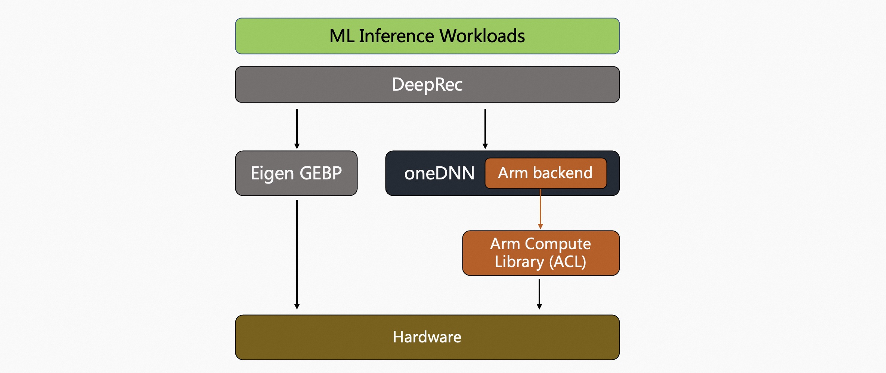

# Arm Compute Library

## Introduction

The [Arm Compute Library](https://github.com/ARM-software/ComputeLibrary) (ACL) is an open-source high-performance computing library developed by ARM, aimed at optimizing compute-intensive tasks on processors based on the ARM architecture.
It provides a range of compute functions and algorithms, including implementations of many modern machine learning algorithms, which can be used for tasks in areas such as deep learning. The [documentation](https://arm-software.github.io/ComputeLibrary/latest/index.xhtml) provides information on the compute primitives supported by ACL.

Currently, ACL support has been added to DeepRec, and ACL acceleration operators can be enabled simply by adding the ACL compilation option `--config=mkl_aarch64` to the DeepRec compilation command.


The integration of ACL into DeepRec is achieved through oneDNN as an intermediate calling layer, as shown in the following figure:


The behavior of ACL can also be controlled through oneDNN macros. For example, users can enable low-precision inference acceleration on devices that support bf16:
```bash
ONEDNN_DEFAULT_FPMATH_MODE=BF16 python foo.py
```
By specifying the environment variable `ONEDNN_DEFAULT_FPMATH_MODE=BF16`, ACL will automatically determine whether the hardware device supports BF16 matrix multiplication instructions. If so, FP32 matrix multiplication will be replaced with BF16 implementation.
