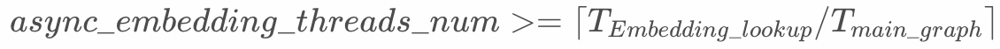

# Asynchronous Embedding Lookup

## Background

In the scenario of distributed training of sparse models, as the model becomes more and more complex, the input features of the model also increase. As a result, the worker node needs to perform a large number of embedding lookup operations on the ps node during each step of training, causing the time-consuming proportion of this operation to increase in training, which becomes the bottleneck of the model training speed.

DeepRec provides the function of asynchronous Embedding lookup, which can automatically determine the subgraph of Embedding lookup and realize the asynchronous execution with the main graph, thereby eliminating the impact of model communication bottleneck on training and improving training performance.

After the embedding lookup operation is asynchronous, the gradient update operation and the embedding lookup operation of the work node are located in different graphs. As a result, the worker node could not obtain the latest embedding lookup result from the PS node, which may affect the training convergence speed and model effect.

## Description

On the premise that the user's original graph has an io stage, the Asynchronous Embedding Lookup function can automatically determine the subgraph of Embedding lookup and realize the asynchronous execution with the main graph.

**Attention**

1. The prerequisite for enabling the Asynchronous Embedding Lookup function is that there is an io stage in the user's original graph, which should be after the sample reading and before the embedding lookup operation. Please refer to [Pipeline-Stage](./Stage.md).
2. This function conflicts with [Pipline-SmartStage](./SmartStage), and the SmartStage function will be turned off if the Asynchronous Embedding Lookup function is enabled.

## User API

Currently, the Asynchronous Embedding Lookup function supports the following Embedding Lookup interfaces in DeepRec.

```python
tf.contrib.feature_column.sequence_input_layer()
tf.contrib.layers.safe_embedding_lookup_sparse()
tf.contirb.layers.input_from_feature_columns()
tf.contirb.layers.sequence_input_from_feature_columns()
tf.feature_column.input_layer()
tf.nn.embedding_lookup()
tf.nn.embedding_lookup_sparse()
tf.nn.safe_embedding_lookup_sparse()
tf.nn.fused_embedding_lookup_sparse()
tf.python.ops.embedding_ops.fused_safe_embedding_lookup_sparse()
```

DeepRec provides the following configuration options in ConfigProto：

```python
sess_config = tf.ConfigProto()
sess_config.graph_options.optimizer_options.do_async_embedding = True
sess_config.graph_options.optimizer_options.async_embedding_options.threads_num = 4
sess_config.graph_options.optimizer_options.async_embedding_options.capacity = 4
sess_config.graph_options.optimizer_options.async_embedding_options.use_stage_subgraph_thread_pool = False # optional
sess_config.graph_options.optimizer_options.async_embedding_options.stage_subgraph_thread_pool_id = 0 # optional
```

| Configuration Options          | Description                                                                                                                  | Default Value                                                                   |
| ------------------------------ | ---------------------------------------------------------------------------------------------------------------------------- | ------------------------------------------------------------------------------- |
| do_async_embedding             | Enable Asynchronous Embedding Lookup or not                                                                                  | False                                                                           |
| threads_num                    | The number of threads that execute embedding lookup subgraph asynchronously                                                  | 0 (must be set)                                                                 |
| capacity                       | The maximum number of Asynchronous Embedding lookup results that a worker node can cache                                     | 0 (must be set)                                                                 |
| use_stage_subgraph_thread_pool | Use an independent thread pool to run the embedding lookup subgraph or not,  need to create an independent thread pool first | False(optional)                                                                 |
| stage_subgraph_thread_pool_id  | index of independent thread pool                                                                                             | 0(optional, the index range is [0, the number of independent thread pools - 1]) |

**Attention**

1. `async_embedding_threads_num` is not as big as possible, you only need to let the execution of the main graph not have to wait for the result of the embedding lookup operation. If the value is too large, it will preempt computing resources for model training and occupy more communication bandwidth. It is recommended to set according to the following formula. You can also start at 1 and adjust upwards to find the best value.



2. A larger `capacity` will consume more memory, and will also cause a larger difference between the cached embedding lookup result and the latest result obtained from the PS node, resulting in slow training convergence. It is recommended to set it to the same value as async_embedding_threads_num, which can be adjusted upwards from 1.

3. The independent thread pool option can make different Stage subgraphs run in different thread pools, avoiding competition with the default thread pool for the main graph and other subgraphs. For how to create an independent thread pool, please refer to [Pipeline-Stage](./Stage.md).

## Performance

### CPU scenario

The performance of this feature in the DLRM model in modelzoo.

The Aliyun ECS instance is ecs.hfc7.24xlarge, the training cluster consists of 10 Aliyun ECS instances. 

**Aliyun ECS Instance configuration information：**

|     | Description                                     |
| --- | ----------------------------------------------- |
| CPU | Intel Xeon Platinum (Cooper Lake) 8369 96 cores |
| MEM | 192 GiB                                         |
| NET | 32 Gbps                                         |

**Training configuration：**

|                      | size |
| -------------------- | ---- |
| PS nodes             | 8    |
| worker nodes         | 30   |
| cpu cores per PS     | 15   |
| cpu cores per worker | 10   |

**Result**

| model | baseline（global steps/sec） | async embedding（global steps/sec） | speedup |
| ----- | -------------------------- | --------------------------------- | ------- |
| DLRM  | 1008.6968                  | 1197.932                          | 1.1876  |

        
