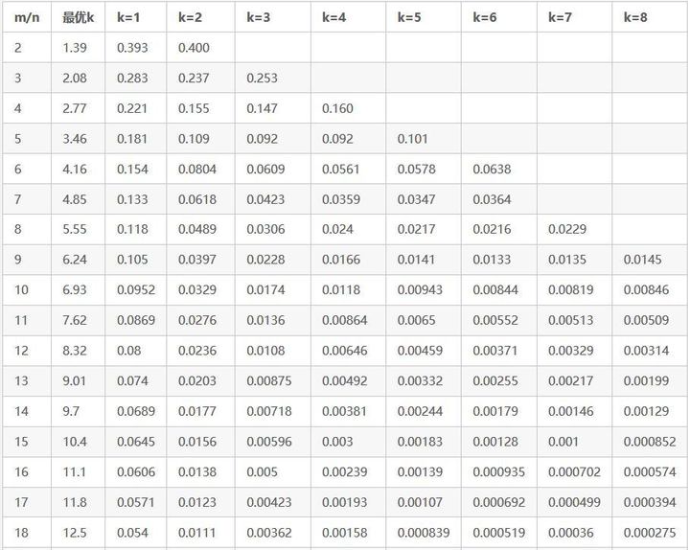
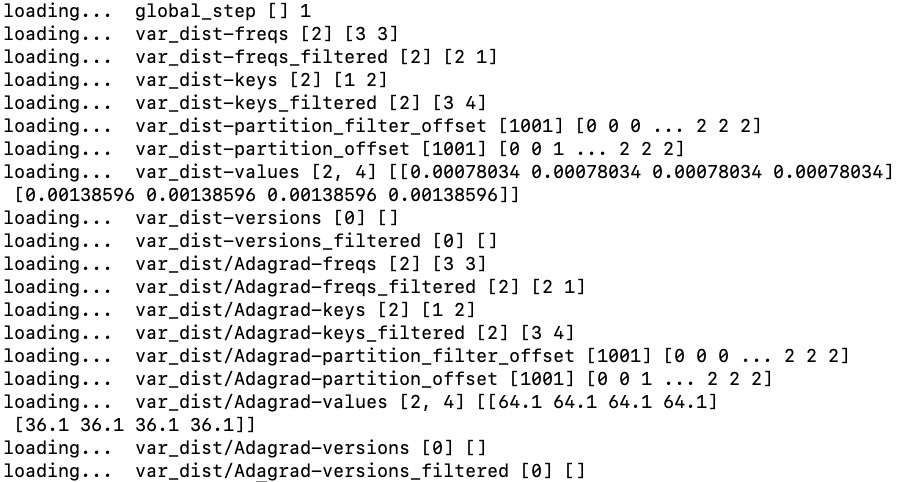

# Feature Filter of EmbeddingVariable
## Introduction
When the frequency of features is too low, not only will it not help the training effect of the model, but it will also cause memory waste and overfitting. In order to solve the above problems, DeepRec provides the feature filter that allows users to filter low-frequency features.
Currently DeepRec supports two feature filters: counter feature filter and Bloom feature filter:

- **Counter feature filter**: The counter feature filter will record the number of times each feature is accessed in the forward process, and only the features whose frequency exceeds the threshold will be assigned to the embedding vector and updated in the backward process. The advantage of this kind of filter is that it can accurately count the number of times of each feature, and at the same time, the frequency query can be completed at the same time as querying the embedding vector, so there is almost no additional time overhead compared to when the feature filter is not used. The disadvantage is that in order to reduce the number of queries, even for features that are not allowed, it is necessary to record all the metadata of the corresponding features. When the rate of access is low, it uses more memory than the bloom feature filter.
- **Bloom feature filter**: Bloom feature filter is implemented based on Counter Bloom Filter. The advantage of this method is that it can greatly reduce memory usage when most of the features are low-frequency. The disadvantage is that multiple hashes and queries are required, which will bring obvious overhead. At the same time, when the proportion of high-frequency features is relatively high, the data structure of the Bloom feature filter will take up a lot of memory.
- **Initialization of filtered features**： When the user uses the feature filter, for the features whose frequency does not exceed the threshold, the embedding value obtained by the query at this time is the default_value_no_permission set in the InitializerOption, and the default value is 0.0.

## Usage

Users can refer to the following example to use the feature filter

```python
#Configure Bloom feature filter
filter_option = tf.CBFFilter(filter_freq=3,
                                         max_element_size = 2**30,
                                         false_positive_probability = 0.01,
                                         counter_type=dtypes.int64)
#Configure Counter feature filter
filter_option = tf.CounterFilter(filter_freq=3)

ev_opt = tf.EmbeddingVariableOption(filter_option=filter_option)
#Enable feature filter with get_embedding_variable API
emb_var = get_embedding_variable("var", embedding_dim = 16, ev_option=ev_opt)

#Enable feature filter with sparse_column_with_embedding API
from tensorflow.contrib.layers.python.layers import feature_column
emb_var = feature_column.sparse_column_wth_embedding("var", ev_option=ev_opt)

#Enable feature filter with categorical_column_with_embedding API
emb_var = tf.feature_column.categorical_column_with_embedding("var", ev_option=ev_opt)
```
The following is the definition of the feature filter interface:
```python
@tf_export(v1=["CounterFilter"])
class CounterFilter(object):
  def __init__(self, filter_freq = 0):
    self.filter_freq = filter_freq
    
@tf_export(v1=["CBFFilter"])
class CBFFilter(object):
  def __init__(self,
               filter_freq = 0,
               max_element_size = 0,
               false_positive_probability = -1.0,
               counter_type = dtypes.uint64)
```
**parameters**：

- `filter_freq`: The minimum frequency that the feature needs to achieve to be trained
- `max_element_size`: The number of features estimated by the user
- `false_positive_probability`: The error rate of the bloom filter
- `counter_type`: Data type of the frequency

The parameter setting of the bloom feature filter can refer to the following table, where m is the length of the bloom filter, n is `max_element_size`, k is the number of hash functions, and the value in the table is `false_positive_probability`:



**Feature filter not configured**: If `CounterFilter` or `CBFFilter` is not passed in when constructing `EmbeddingVariableOption` object, or `filter_freq` is set to 0, the feature filter is disabled.

**Checkpoint**: When using `tf.train.saver`, regardless of whether the frequency of the feature reaches the threshold, its id and frequency will be recorded in checkpoint, and the embedding of filtered features will not be saved in checkpoint. When loading checkpoint, for the filtered features in checkpoint, it is determined whether to be filtered in the new round of training by comparing its frequency with the threshold value of the filter. For the features that have participated in the training, no matter whether the feature frequency in checkpoint exceeds the threshold, it is considered to be a feature that has been admitted in the new round of training. At the same time, checkpoint supports forward compatibility, checkpoint without counter records can be read. Incremental checkpoint is not currently supported.

**Configure filter_freq**: Users need to configure according to the samples.

**Feature filter and embedding multi-tier storage**: Because the bloom feature filter and the Embedding multi-tier storage are based on different counting components, opening two features at the same time will cause errors in the counting function, so it is currently invalid to use bloom feature filter and the embedding multi-tier storage at the same time.

**Collect information of filtered features**：

If a user wants to obtain information about filtered features, such as their ids and frequencies, the user can obtain this information by reading the content in the checkpoint. The method of reading the content in the checkpoint is as follows:
```python
from tensorflow.contrib.framework.python.framework import checkpoint_utils
for name, shape in checkpoint_utils.list_variables("xxxxx.ckpt"):
      print('loading... ', name, shape, checkpoint_utils.load_variable("xxxxx.ckpt", name))
```

Execute the above code to get the following results:

For an EmbeddingVariable, it will be divided into 9 parts when it is stored in checkpoint. Assuming that the name of the EmbeddingVariable is var, users will see in checkpoint:

- `var-keys`: Ids of the unfiltered features
- `var-values`: Embeddings of the unfiltered features
- `var-freqs`: Frequencies of the unfiltered features
- `var-versions`: Last updated step of the unfiltered features
- `var-keys_filtered`: Ids of the filtered features
- `var-freqs_filtered`: Frequencies of the filtered features
- `var-versions_filtered`: Last updated step of the filtered features
- `var-partition_offset`: Parameters for restoring unfiltered features
- `var-partition_filter_offset`: Parameters for restoring filtered features

Users can collect information about filtered features by reading data with `_filtered` suffix.

**Whether to save information of filtered features**

Users sometimes don‘t need to save the information of filtered features when saving the ckpt (for example, the information of filtered features is not needed during serving). Users can set the environment variable `TF_EV_SAVE_FILTERED_FEATURES` to `False` to not save the information of the filtered features, thus reducing the size of the checkpoint.