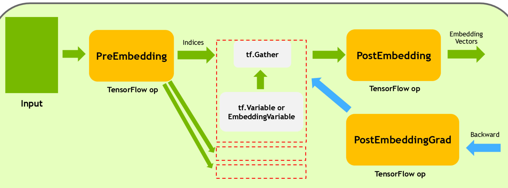

# Embedding Subgraph Fusion Doc

## Introduction

The native embedding lookup API's of DeepRec and TensorFlow, such as `safe_embedding_lookup_sparse`, create quite a lot of ops, and thus often run into kernel launch bound issues when executed on a GPU. To solve this problem, the Embedding Subgraph Fusion feature provides a set of APIs and fusion ops that can reduce the number of kernels to be launched. Together with high-performance implementations, it can accelerate execution on the GPU.

## FeatureColumn API

Users interact with FeatureColumn as an interface. The embedding_column function returns an instance of the EmbeddingColumn class, commonly used EmbeddingColumn are:

1. `EmbeddingColumn` in `tensorflow/python/feature_column/feature_column_v2.py`
2. `_EmbeddingColumn` in `tensorflow/contrib/layers/python/layers/feature_column.py`

Then, it is typically passed into high level interfaces such as `tf.feature_column.input_layer` or `tf.feature_column_ops.input_from_feature_columns` to build the lookup-related computation graph.

Therefore, the Embedding Subgraph Fusion feature has added a `do_fusion` attribute to the above-mentioned EmbeddingColumn classes, which defaults to `False`. The user can set it to `True` explicitly when using it, making the embedding lookup process use fusion ops.

An examples:


```python
import tensorflow as tf
from tensorflow.python.framework import ops


columns = tf.feature_column.categorical_column_with_embedding("col_emb", dtype=tf.dtypes.int64)
W = tf.feature_column.embedding_column(categorical_column=columns,
            dimension=3,
            initializer=tf.ones_initializer(tf.dtypes.float32),
            do_fusion=True)

ids={}
ids["col_emb"] = tf.SparseTensor(indices=[[0,0],[1,1],[2,2],[3,3],[4,4]], values=tf.cast([1,2,3,4,5], tf.dtypes.int64), dense_shape=[5, 4])

emb = tf.feature_column.input_layer(ids, [W])
fun = tf.multiply(emb, 2.0, name='multiply')
loss = tf.reduce_sum(fun, name='reduce_sum')
opt = tf.train.FtrlOptimizer(0.1, l1_regularization_strength=2.0, l2_regularization_strength=0.00001)
g_v = opt.compute_gradients(loss)
train_op = opt.apply_gradients(g_v)
init = tf.global_variables_initializer()

with tf.Session() as sess:
    sess.run(init)
    print("init global done")
    print(sess.run([emb, train_op,loss]))
    print(sess.run([emb, train_op,loss]))
    print(sess.run([emb, train_op,loss]))
```
```python
import tensorflow as tf
from tensorflow.python.framework import ops
from tensorflow.contrib.layers.python.layers import feature_column_ops
from tensorflow.contrib.layers.python.layers import feature_column


columns = feature_column.sparse_column_with_embedding(column_name="col_emb", dtype=tf.dtypes.int64)
W = feature_column.embedding_column(sparse_id_column=columns,
            dimension=3,
            initializer=tf.ones_initializer(tf.dtypes.float32),
            do_fusion=True)


ids={}
ids["col_emb"] = tf.SparseTensor(indices=[[0,0],[1,1],[2,2],[3,3],[4,4]], values=tf.cast([1,2,3,4,5], tf.dtypes.int64), dense_shape=[5, 4])

# 传入设置了 do_fusion 的 EmbeddingColumn 实例
emb = feature_column_ops.input_from_feature_columns(columns_to_tensors=ids, feature_columns=[W])
fun = tf.multiply(emb, 2.0, name='multiply')
loss = tf.reduce_sum(fun, name='reduce_sum')
opt = tf.train.FtrlOptimizer(0.1, l1_regularization_strength=2.0, l2_regularization_strength=0.00001)
g_v = opt.compute_gradients(loss)
train_op = opt.apply_gradients(g_v)
init = tf.global_variables_initializer()

with tf.Session() as sess:
    sess.run(init)
    print("init global done")
    print(sess.run([emb, train_op,loss]))
    print(sess.run([emb, train_op,loss]))
    print(sess.run([emb, train_op,loss]))
```
## fused_safe_embedding_lookup_sparse API

Use `fused_safe_embedding_lookup_sparse` in `tf.contrib.layers.python.layers.embedding_ops` or `tf.python.ops.embedding_ops`

```python
def fused_safe_embedding_lookup_sparse(embedding_weights,
                                       sparse_ids,
                                       sparse_weights=None,
                                       combiner="mean",
                                       default_id=None,
                                       name=None,
                                       partition_strategy="div",
                                       max_norm=None,
                                       prune=True):
```
This API is consistent with the functionality of DeepRec's `safe_embedding_lookup_sparse` interface. Therefore, the parameters will not be discussed again and can be viewed in the related documentation.

## fused_embedding_lookup_sparse API

Use `nn.fused_embedding_lookup_sparse`

```python
def fused_embedding_lookup_sparse(params,
                                  sp_ids,
                                  sparse_weights=None,
                                  partition_strategy=None,
                                  name=None,
                                  combiner=None,
                                  max_norm=None,
                                  default_id=None,
                                  prune_invalid_ids=False,
                                  blocknums=None):
```

- `params`: List, which can contain a single embedding tensor or partitioned embedding tensors. The rank of embedding tensors must be 2.
- `sp_ids`: SparseTenor, whose values are the IDs to be looked up. The rank of the indices must be 2. The rank of the dense_shape must be 1, and the number of elements must be 2.
- `sparse_weights`: weights of the values of the sp_ids.
- `partition_strategy`: The partition strategy of the embedding tensors.
- `name`: The name of this operation.
- `combiner`: The strategy to combine dimensions of entries.
- `max_norm`: If not None, calculate the l2 for each.
- `embedding`: vector, and normalize for values that exceed max_norm.
- `default_id`: For empty rows, fill in default_id. If default_id is None, fill in 0 by default.
- `prune_invalid_ids`: whether to remove invalid values (id < 0) from sp_ids
- `blocknums`: parameter used for DynamicEmbeddingVariable.

## Please Note

1. Currently, GPU Embedding subgraph Fusion only supports execution on Nvidia GPUs. The corresponding `tf.Variable` and `EmbeddingVariable`, as well as other operators, can run on the CPU.

2. Currently, setting weights `sparse_weights` is not supported.
3. The partition_strategy currently only supports div, and the embedding tensor is split on axis = 0. If the embedding tensor is an `EmbeddingVariable`, it can only be a single ev at present, and the partitioned lookup for ev is not supported.
4. Currently, the Dynamic Dimension, Multi-Hash Variable, and AdaptiveEmbedding features are not supported, and will be supported gradually in the future.

## Op and computation graph

Newly added Embedding Fusion related ops:

1. FusedEmbeddingSparsePreLookUp
2. FusedEmbeddingSparsePostLookUp
3. FusedEmbeddingSparsePostLookUpGrad


Calling the low-level API `fused_embedding_lookup_sparse` will create the following computation graph:



1. **FusedEmbeddingSparsePreLookUp** is mainly responsible for filling empty rows, pruning invalid IDs, and partitioning the values and indices of sp_ids according to the partition_strategy.

2. **tf.Gather** is located on the same device as **EmbeddingVariable** or **tf.Variable** and in case of partition, there may be multiple copies of it, located on different devices (distributed). It receives the values and indices partitioned by PreEmbedding, and performs the actual embedding vector lookups.

3. **FusedEmbeddingSparsePostLookUp** then collects the embedding vectors from each partition, and performs related operations such as combiner and max_norm.

4. **FusedEmbeddingSparsePostLookUpGrad** is responsible for calculating the backward gradient of FusedEmbeddingSparsePostLookUp."

## Performance

We compared performance of several models in modelzoo w/ and w/o fusion(average runtime of 5000 iterations):

Machine:
8 cores AMD EPYC 7232P CPU @ 3.20GHz.

A100-80GB-PCIE GPU

DLRM Model:

|         | Avg Time per Iteration |
| ------- | ---------------------- |
| Unfused | 20.78 ms               |
| Fused   | 17.41 ms               |
| SpeedUp | 1.19x                  |

DeepFM Model:

|         | Avg Time per Iteration |
| ------- | ---------------------- |
| Unfused | 37.24 ms               |
| Fused   | 30.98 ms               |
| SpeedUp | 1.20x                  |

WDL Model:

|         | Avg Time per Iteration |
| ------- | ---------------------- |
| Unfused | 36.38 ms               |
| Fused   | 34.52 ms               |
| SpeedUp | 1.05x                  |
