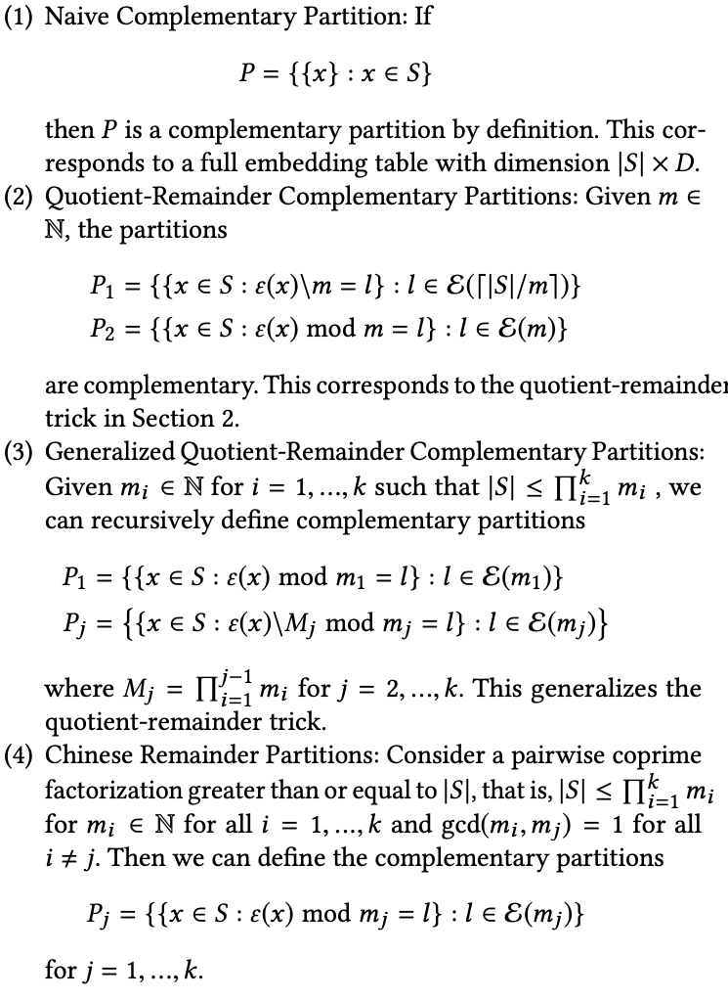

# Multi-Hash Variable

## Background

In the deep learning scenario, in order to train the features of the ID class (such as user id or item id), the sparse features of the id class are usually mapped to the corresponding low-dimensional dense embedding vectors. In the recommendation scenario, as the amount of data gradually increases, a corresponding embedding vector is stored for each id class feature, that is, the non-conflicting Hash scheme (EmbeddingVariable) will cause the model to be larger than the model under the conflicting Hash method. (Variable). In order to solve the Training/Inference performance and resource overhead caused by larger models, DeepRec has provided several ways to solve performance and resource problems. 1) Feature elimination, by eliminating and cleaning outdated features, avoiding excessive accumulation of expired features , wastes memory; 2) feature access, low-frequency feature access mechanism, avoiding low-frequency feature overfitting while reducing memory usage; 3) mixed multi-level EmbeddingVariable, supported by storing unpopular features in cheap and larger storage media Larger models; 4) DynamicDimensionEmbeddingVariable, by using strategies to allow unpopular features to be expressed with smaller dims to reduce the storage space occupied by unpopular features. The Multi-Hash Variable introduced in this article is another way to reduce memory/video memory usage.​

《Compositional Embeddings Using Complementary Partitions for Memory-Efficent Recommendation Systems》proposes a new way to reduce memory usage, the specific method is:

1. Construct several small Embedding tables
2. Each corresponding table corresponds to a hash function, and these hash functions need to be complementary, that is, for each id, its corresponding hash value set is unique, and is not exactly the same as any other id. For example, when there are two embedding tables, using Quotient-Reminder can ensure that each key has a unique hash set, as shown in the following figure:



3. According to a certain strategy, the embeddings taken from multiple tables are combined into the final emebdding, such as add, multiply, and concat.

## Multi-Hash Variable

In DeepRec, we implemented the Multi-Hash Variable. You can use this feature through `get_multihash_variable` interface as follows:

```python
def get_multihash_variable(name,
                           dims,
                           num_of_partitions=2,
                           complementary_strategy="Q-R",
                           operation="add",
                           dtype=float,
                           initializer=None,
                           regularizer=None,
                           trainable=None,
                           collections=None,
                           caching_device=None,
                           partitioner=None,
                           validate_shape=True,
                           use_resource = None,
                           custom_getter=None,
                           constraint=None,
                           synchronization=VariableSynchronization.AUTO,
                           aggregation=VariableAggregation.NONE):

# name: multihash variable's name
# embedding dim：A list needs to be passed in. If the length of the list is 1, the operation must be selected from add or mult;
                 If the length of the list is greater than 1, then the operation must choose concat, and the total length of the elements in the list must be equal to embedding_dim
# num_of_partions: The number of variable partitions. If complementary_strategy is "Q-R", then the
                   Argument must be 2.
# complementary_strategy: "Q-R" is supported
# operation：one of "add", "mult" and "concat"
# intialier：same as variable
# partitioner：same as variable
```

Only two partitions are supported for multi-hashing using the QR method. The reason is that according to the experiments in the paper, this method can already support most scenarios. At the same time, the method of more than three partitions is relatively complicated and will bring more problems. Much lookup overhead.​

## Example

Use inferface `get_multihash_variable`

```python
import tensorflow as tf

def main(unused_argv):
  embedding = tf.get_multihash_variable("var-dist",
                                         [[2,2],[2,2]],
                                         complementary_strategy="Q-R",
                                         operation="concat",
                                         initializer=tf.ones_initializer)
  var = tf.nn.embedding_lookup(embedding, [0,1,2,3])
  fun = tf.multiply(var, 2.0, name='multiply')
  loss1 = tf.reduce_sum(fun, name='reduce_sum')
  opt = tf.train.AdagradOptimizer(0.1)
  g_v = opt.compute_gradients(loss1)
  train_op = opt.apply_gradients(g_v)
  init = tf.global_variables_initializer()

  with tf.Session() as sess:
       sess.run([init])
       print(sess.run([var, train_op]))
       print(sess.run([var, train_op]))
       print(sess.run([var, train_op]))

if __name__=="__main__":
  tf.app.run()
```

Use inferface `categorical_column_with_multihash`

```python
import tensorflow as tf
from tensorflow.python.framework import ops
from tensorflow.python.feature_column import feature_column_v2 as fc2

columns = fc2.categorical_column_with_multihash("col_emb", dims = (2,2))
W = tf.feature_column.embedding_column(categorical_column=columns,
            dimension=(2,3),
            initializer=tf.ones_initializer(tf.dtypes.float32))

ids={}
ids["col_emb"] = tf.SparseTensor(indices=[[0,0],[1,1],[2,2],[3,3]], values=tf.cast([0,1,2,3], tf.dtypes.int64), dense_shape=[4, 4])

emb = tf.feature_column.input_layer(ids, [W])
fun = tf.multiply(emb, 2.0, name='multiply')
loss1 = tf.reduce_sum(fun, name='reduce_sum')
opt = tf.train.AdagradOptimizer(0.1)
g_v = opt.compute_gradients(loss1)
train_op = opt.apply_gradients(g_v)
init = tf.global_variables_initializer()

with tf.Session() as sess:
    sess.run(init)
    print("init global done")
    print(sess.run([emb, train_op]))
    print(sess.run([emb, train_op]))
    print(sess.run([emb, train_op]))
```
