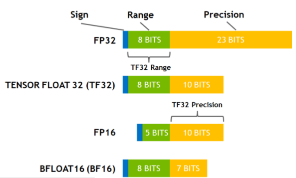
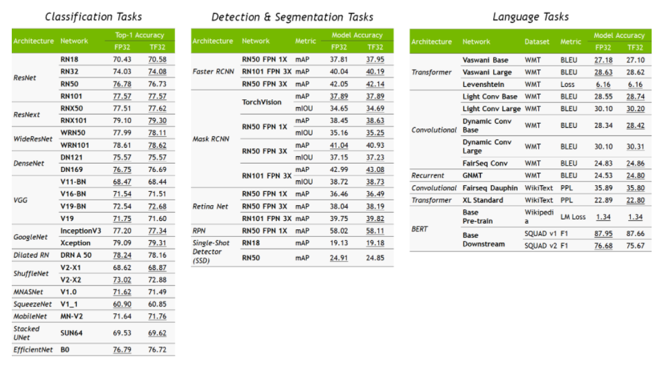

# NVIDIA TF32

## TF32 Intorduction

TensorFloat-32 is a computational format that is specifically designed for use with TensorCore on Nvidia's Ampere architecture GPUs. When comparing with other common data formats:




On A100, using TF32 for matrix multiplication can provide 8x faster performance than using FP32 CUDA Core on V100. Note that TF32 is only a intermediate computation format when using TensorCore.
​

## Usage and Prerequisites

Prerequisites:

1. Matrix multiplication and convolution-related operations, and input data type is FP32, can use TF32 as TensorCore's intermediate computation type.
2. Ampere architecture GPU

Typically, the use of TF32 is usaged automatically by cuBlas, cuDNN, and other Nvidia computation libraries internally. Therefore, regardless of the deep learning framework you use on top, make sure:

1. cuBLAS >= 11.0
2. cuDNN >= 8.0

On Ampere architecture GPU, TF32 is enabled by default for computation acceleration. However, not every matrix and convolution computation will necessarily use TF32, depending on factors such as the input data type and shape. TF32 will be used as much as possible when appropriate.

To forcefully disable TF32, you can set the environment variable:

```bash
export NVIDIA_TF32_OVERRIDE=0
```

to command all Nvidia libraries to turn off TF32.
​

## Impact of TF32 on precision

Nvidia has compared the precision difference of various well-known models between FP32 and TF32 and found that TF32 has little impact on precision:


## More Info

1. [https://developer.nvidia.com/blog/accelerating-ai-training-with-tf32-tensor-cores/](https://developer.nvidia.com/blog/accelerating-ai-training-with-tf32-tensor-cores/)
1. [https://blogs.nvidia.com/blog/2020/05/14/tensorfloat-32-precision-format/](https://blogs.nvidia.com/blog/2020/05/14/tensorfloat-32-precision-format/)
