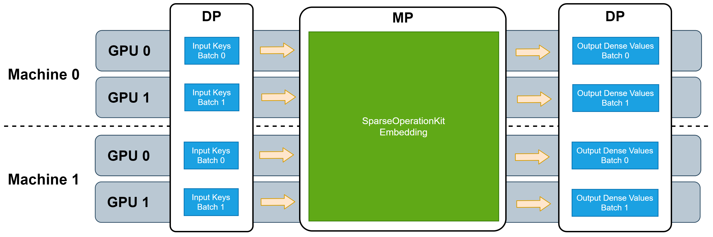

# Distributed Synchronous Training-SOK
## Introduction

Sparse Operation Kit (SOK) is a Python package wrapped GPU accelerated operations dedicated for sparse training / inference cases. It is designed to be compatible with common deep learning (DL) frameworks like TensorFlow.
 	
## Features
### Model-Parallelism GPU Embedding Layer
In sparse training / inference scenarios, for instance, CTR estimation, there are vast amounts of parameters which cannot fit into the memory of a single GPU. Many common DL frameworks only offer limited support for model parallelism (MP), because it can complicate using all available GPUs in a cluster to accelerate the whole training process.

SOK provides broad MP functionality to fully utilize all available GPUs, regardless of whether these GPUs are located in a single machine or multiple machines. Simultaneously, SOK takes advantage of existing data-parallel (DP) capabilities of DL frameworks to accelerate training while minimizing code changes. With SOK embedding layers, you can build a DNN model with mixed MP and DP. MP is used to shard large embedding parameter tables, such that they are distributed among the available GPUs to balance the workload, while DP is used for layers that only consume little GPU resources.

SOK provides multiple types of MP embedding layers, optimized for different application scenarios. These embedding layers can leverage all available GPU memory in your cluster to store/retrieve embedding parameters. As a result, all utilized GPUs work synchronously.

SOK is compatible with DP training provided by common synchronized training frameworks, such as Horovod. Because the input data fed to these embedding layers can take advantage of DP, additional DP from/to MP transformations are needed when SOK is used to scale up your DNN model from single GPU to multiple GPUs. The following picture illustrates the workflow of these embedding layers.


 	
## API
- SOK is compatible with Horovod as a communication tool. First, it is initialized through the initialization function of SOK, and then two different embedding layers of sok are selected for embedding. In the process of backpropagation, we could select the optimizer optimized by SOK and some additional functions in Utilizers.
- Users can use either GroupEmbedding API in DeepRec, or use the original interface of SOK.

### GroupEmbedding API in DeepRec

#### Initialize
The GroupEmbedding interface provides localized and distributed training modes. We can use SOK in the distributed mode, first we need to enable the settings `tf.config.experimental.enable_distributed_strategy(strategy="collective")`，it would initialize Horovod and SOK related modules.

```python
import tensorflow as tf
tf.config.experimental.enable_distributed_strategy(strategy="collective")
```

#### Embeddings
GroupEmbedding provide two level of API. The one is `tf.nn.group_embedding_lookup_sparse`  and the other is `tf.feature_column.group_embedding_column_scope` whis is based on feature_column API。

**group_embedding_lookup_sparse**

```python
def group_embedding_lookup_sparse(params,
                                  sp_ids,
                                  combiners,
                                  partition_strategy="mod",
                                  sp_weights=None,
                                  name=None):
```

- `params` : List, This parameter could receive one or more EmbeddingVariables or native Tensorflow Variable.
- `sp_ids` : List | Tuple , SparseTensor sp_ids ​​is the ID used for EmbeddingLookup, the length must be consistent with params.
- `combiners` : List | Tuple，The pooling method of embedding values.Currently support `mean` and `sum`.
- `partition_strategy` : str，Currently not supported.
- `sp_weights` : List | Typle the weight of sp_ids values.(Currently not supported.)
- `name` : str group name

**group_embedding_column_scope**

```python
def group_embedding_column_scope(name=None):
```
- `name` ： The name of scope.

We need to initialize a context `group_embedding_column_scope`
, and complete the construction of `EmbeddingColumn` in that context. Later, the EmbeddingColumn Lookup would be simultaneously aggregate by `tf.feature_column.input_layer`. It is worth noting that the underlying implementation of this function is designed for `tf.RaggedTensor`。Although the IDS for EmbeddingLookup also supports `SparseTensor`, it will still be converted to `RaggedTensor` in the end, which will introduce a certain performance overhead.

### Original API in SOK

#### Initialize
```python
sparse_operation_kit.core.initialize.Init(**kwargs)
```
Abbreviated as sok.Init(**kwargs).

This function is used to do the initialization of SparseOperationKit (SOK). In DeepRec, SOK supports Horovod. It can be used as:
```python
sok_init = sok.Init(global_batch_size=args.global_batch_size)
with tf.Session() as sess:
    sess.run(sok_init)
    ...
```
#### Embeddings
Embeddings includes sparse embedding and dense embedding. The `sok.DistributedEmbedding` is equivalent to `tf.nn.embedding_lookup_sparse` and `sok.All2AllDenseEmbedding` is equivalent to `tf.nn.embedding_lookup`.

**Distributed Sparse Embedding**
```python
class sparse_operation_kit.embeddings.distributed_embedding.DistributedEmbedding(combiner, max_vocabulary_size_per_gpu, embedding_vec_size, slot_num, max_nnz, max_feature_num=1, use_hashtable=True, **kwargs)
```
This is a wrapper class for distributed sparse embedding layer. It can be used to create a sparse embedding layer which will distribute keys based on gpu_id = key % gpu_num to each GPU.
Parameters:
- `combiner (string)` – it is used to specify how to combine embedding vectors intra slots. Can be Mean or Sum.

- `max_vocabulary_size_per_gpu (integer)` – the first dimension of embedding variable whose shape is [max_vocabulary_size_per_gpu, embedding_vec_size].

- `embedding_vec_size (integer)` – the second dimension of embedding variable whose shape is [max_vocabulary_size_per_gpu, embedding_vec_size].

- `slot_num (integer)` – the number of feature-fileds which will be processed at the same time in each iteration, where all feature-fileds produce embedding vectors of the same dimension.

- `max_nnz (integer)` – the number of maximum valid keys in each slot (feature-filed).

- `max_feature_num (integer = slot_num*max_nnz)` – the maximum valid keys in each sample. It can be used to save GPU memory when this statistic is known. By default, it is equal to .

- `use_hashtable (boolean = True)` – whether using Hashtable in EmbeddingVariable, if True, Hashtable will be created for dynamic insertion. Otherwise, the input keys will be used as the index for embedding vector looking-up, so that input keys must be in the range [0, max_vocabulary_size_per_gpu * gpu_num).

- `key_dtype (tf.dtypes = tf.int64)` – the data type of input keys. By default, it is tf.int64.

- `embedding_initializer (string or an instance of tf.keras.initializers.Initializer)` – the initializer used to generate initial value for embedding variable. By default, it will use random_uniform where minval=-0.05, maxval=0.05.

**All2All Dense Embedding**
```python
classsparse_operation_kit.embeddings.all2all_dense_embedding.All2AllDenseEmbedding(max_vocabulary_size_per_gpu, embedding_vec_size, slot_num, nnz_per_slot, dynamic_input=False, use_hashtable=True, **kwargs)
```
Abbreviated as sok.All2AllDenseEmbedding(*args, **kwargs).

This is a wrapper class for all2all dense embedding layer. It can be used to create a dense embedding layer which will distribute keys based on gpu_id = key % gpu_num to each GPU.
Parameters
- `max_vocabulary_size_per_gpu (integer)` – the first dimension of embedding variable whose shape is [max_vocabulary_size_per_gpu, embedding_vec_size].

- `embedding_vec_size (integer)` – the second dimension of embedding variable whose shape is [max_vocabulary_size_per_gpu, embedding_vec_size].

- `slot_num (integer)` – the number of feature-fileds which will be processed at the same time in each iteration, where all feature-fileds produce embedding vectors of the same dimension.

- `nnz_per_slot (integer)` – the number of valid keys in each slot. The number of valid keys in each slot is the same.

- `dynamic_input (boolean = False)` – whether the inputs.shape is dynamic. For example, the inputs tensor is comming from tf.unique. When dynamic_input=True, unique->lookup->gather pattern can be used. By default, it is False, which means the inputs.size must be replica_batchsize * slot_num * nnz_per_slot.

- `use_hashtable (boolean = True)` – whether using Hashtable in EmbeddingVariable, if True, Hashtable will be created for dynamic insertion. Otherwise, the input keys will be used as the index for embedding vector looking-up, so that input keys must be in the range [0, max_vocabulary_size_per_gpu * gpu_num).

- `key_dtype (tf.dtypes = tf.int64)` – the data type of input keys. By default, it is tf.int64.

- `embedding_initializer (string or an instance of tf.keras.initializers.Initializer)` – the initializer used to generate initial value for embedding variable. By default, it will use random_uniform where minval=-0.05, maxval=0.05.

#### Optimizers
The unique and unsorted_segment_sum are replaced with GPU implementations.

**Adam optimizer**
`classsparse_operation_kit.tf.keras.optimizers.adam.Adam(*args, **kwargs)`

**Local update Adam optimizer**
`classsparse_operation_kit.tf.keras.optimizers.lazy_adam.LazyAdamOptimizer(*args, **kwargs)`

#### Utilizers
`sparse_operation_kit.optimizers.utils.split_embedding_variable_from_others(variables)`
This function is used to split embedding variables from other variables.

Abbreviated as sok.split_embedding_variable_from_others(variables).

Embedding variables are automatically created along with embedding layers. Since the aggregation for embedding variables is different from other variables, we need to split embedding variable and other variables so that optimizer can process those variables in different way.

Parameters
- `variables (list, tuple)` – a list or tuple of trainable tf.Variable.

Returns
- `embedding_variables (tuple)` – all embedding variables in the input variable-list.

- `other_variables (tuple)` – all normal variables in the input variable-list.

## Detailed Doc
- For detailed introduction of GroupEmbedding, user can refer [GroupEmbedding documents](./Group-Embedding.md)
- For detailed introduction, user can refer [SparseOperationKit documents](https://nvidia-merlin.github.io/HugeCTR/sparse_operation_kit/master/index.html).
