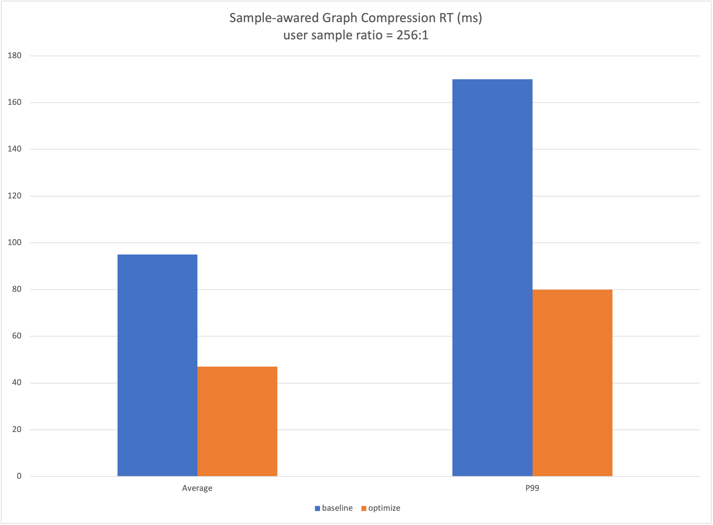

# Sample-awared Graph Compression
## Background
In the recommendation scenario, the composition of the sample is often <user, item>, and it is a one-to-many composition form. It has the following characteristics:
### Sample Features
As the source of model training, samples determine the composition of the model and affect the calculation of the model. In the recommendation scenario, several samples produced by one page exposure have the commonality of the same user, that is,

```
user_1_feature, item_1_feature, label_1
user_1_feature, item_2_feature, label_2
... ...
user_1_feature, item_N_feature, label_N
```

It leads to redundancy in the storage of samples, wastes storage space.

### Model Features
Under such sample characteristics, the redundant samples read in must also lead to computational redundancy. For the above samples, when training the model, inside the batch, user_1_feature will repeat the run sub-graph (such as: Attention Graph) several times . This part of the calculation is completely redundant and can be saved at runtime, only calculated once.

## Feature
In the training and inference scenarios, using the characteristics of samples and models, without the need for users to modify the Graph, connect the compressed samples prepared by the user, automatically optimize the graph, and improve the performance of training and inference.

### Training & Inference
Before the user constructs the training/inference graph, call the python API to open the function and automatically optimize the graph.

## API
```
tf.graph_optimizer.enable_sample_awared_graph_compression(user_tensors,
                                                          item_tensors,
                                                          item_size)
Args:
    user_tensors: user sample
    item_tensors: non-user sample
    item_size: the number of items
```
## Example
### Training
TODO
### Inference

```
USER_FEATURE = ['user_feature_0', 'user_feature_1']
ITEM_FEATURE = ['item_feature_0', 'item_feature_1']
ALL_FEATURE = USER_FEATURE + ITEM_FEATURE

def serving_input_receiver_fn():
  item_size = tf.placeholder(dtype=tf.int32, shape=[None], name='item_size')
  features = {}
  inputs = {"item_size": item_size}
  user_tensors = []
  item_tensors = []
  for fea_name in ALL_FEATURE:
    features[fea_name] = tf.placeholder(tf.string, [None], name=fea_name)
    inputs[fea_name] = features[fea_name]
    if fea_name in ITEM_FEATURE:
      item_tensors.append(features[fea_name])
    else:
      user_tensors.append(features[fea_name])

    """Enable Sample-awared Graph Compression"""
    tf.graph_optimizer.enable_sample_awared_graph_compression(
        user_tensors,
        item_tensors,
        item_size)

  return tf.estimator.export.ServingInputReceiver(features, inputs)

estiamtor = ...
estiamtor.export_savedmodel(output_dir, serving_input_receiver_fn)
```
1. Need to use [estimator](https://github.com/DeepRec-AI/estimator) provided by DeepRec at the same time

2. Input data format
    Generally, in the inference scenario, the input data is protobuf, which contains the values of each feature required by the model and the tensor indicating the number of items in the sample. The user tensor shape is [Duser], and the item tensor shape is [N, Ditem]

## Performance

Compressing user-side features reduces the end-to-end delay of Inference. In a cloud online service case, the performance results are as follows:


