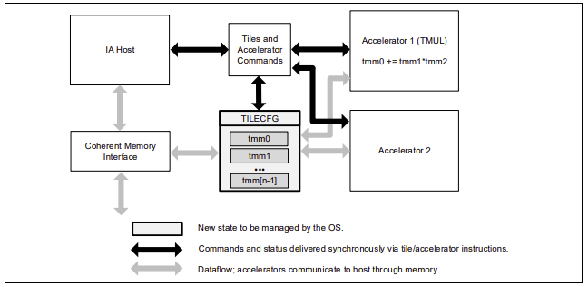

# Intel® AMX

Intel® Advanced Matrix Extensions (Intel® AMX) 是第四代英特尔® 至强® 可扩展处理器 Sappire Rapids [阿里云通用型实例规格族g8i](https://help.aliyun.com/document_detail/25378.html#g8i) 支持的一种指令集技术，用于加速深度学习的训练和推理，分别支持两种数据类型BFloat16和Int8。有关Bfloat16数据类型的细节和使用方式，请参考[Bfloat16的详细介绍](BFloat16.md)

Intel® AMX是一种新的64位编程范式，由两个组件组成：一组二维寄存器(Tiles)来存储二维矩阵数据，以及一个能够操作这些寄存器的加速器，成为矩阵乘法单元TMUL（Tile Matrix Multiply Unit），每个CPU核心都配有一个AMX加速单元，从而实现对深度学习计算中的矩阵计算和卷积计算等热点进行加速。AMX加速单元的具体架构如下图所示。



## 使用条件与方法

#### 使用条件：
云实例要求第四代英特尔® 至强® 可扩展处理器 Sappire Rapids [阿里云通用型实例规格族g8i](https://help.aliyun.com/document_detail/25378.html#g8i)，并且需要采用 oneDNN 编译优化的 DeepRec，才能提供 AMX 指令加速，具体编译可以在 oneDNN 章节了解详情。AMX的使用除了对硬件特殊要求外，软件上也需要满足以下条件。
- OS或者内核版本： 要求内核必须是5.16及以上，阿里云提供的Anolis和Ubuntu2204都是支持的
- Python版本：如果使用的是python API，要求python版本是3.8及以上，否则可能无法启用AMX；如果是C++ API，则没问题

#### 使用方法：
由于推荐场景对模型精度的要求极其严苛，所以为了提升模型性能的同时，兼顾模型精度，用户一般可以使用AMX对BFloat16的加速功能。推荐使用以下两种方式使用AMX.

##### 使用Bfloat16 API自由控制 BF16 计算图（适用于训练场景）
该方法的具体使用步骤请参考[Bfloat16的详细介绍](BFloat16.md)。该方法的好处是，可以由开发者自由地控制哪些图使用BF16，哪些图保持FP32，从而保持较好的模型精度，同时因为默认实现了一些算子融合，避免了一些额外的转换开销，实现较快的运行速度。如果开发者希望更简单地使用AMX，则可以考虑下面这种方式，通过设置环境变量来控制。
##### 通过设置环境变量`ONEDNN_DEFAULT_FPMATH_MODE=bf16`来使用AMX（训练和推理场景均适用）
该方法由oneDNN数据库提供功能支持，不需要用户修改代码，自动识别矩阵乘法，使用AMX的BF16指令集进行计算加速，使用非常便捷，但是性能和精度可能比第一种方法略差一点。具体效果依赖于实际模型。
```
export ONEDNN_DEFAULT_FPMATH_MODE=bf16
```
另外，可以通过打开`ONEDNN_VERBOSE`环境变量来确认AMX是否生效，如果生效，会输出打印AMX等关键字信息。
```
export ONEDNN_VERBOSE=1
```
## 性能对比

以下提供使用BFloat16自由控制计算图的方式来使用AMX进行数据对比。使用 DeepRec Modelzoo 中模型，对比 DeepRec 开启 BF16 后对比 FP32 的性能提升。Modelzoo 中模型通过添加 `--bf16` 参数启用 BF16 特性。

测试机器使用阿里云 ECS 云服务器，Intel Xeon Sappire Rapids CPU，规格为 [ecs.g8i.4xlarge](https://help.aliyun.com/document_detail/25378.html#g8i)

- 硬件配置：
  - Intel(R) Xeon(R) Platinum 8475B
  - CPU(s): 16
  - Socket(s): 1
  - Core(s) per socket: 8
  - Thread(s) per core: 2
  - Memory: 64G
  

- 软件配置：
  - kernel: Linux version 5.15.0-58-generic 
  - OS: Ubuntu 22.04.2 LTS
  - GCC: 11.3.0
  - Docker: 20.10.21
  - Python: 3.8

性能结果：
| **Throughput** | **WDL**  | **MMoE** | **DSSM**  |
|----------------|----------|------------|-----------|
| FP32           | 33605.22 | 69538.47    | 102072.3 |
| FP32+BF16      | 85801.28  | 155582   | 209099.7 |
| Speedup        | 2.55x    | 2.24x      | 2.05x     |

BF16 对模型训练的 AUC 结果影响很小，具体细节可以从 Modelzoo 中的每个模型的说明文档中找到差异。

