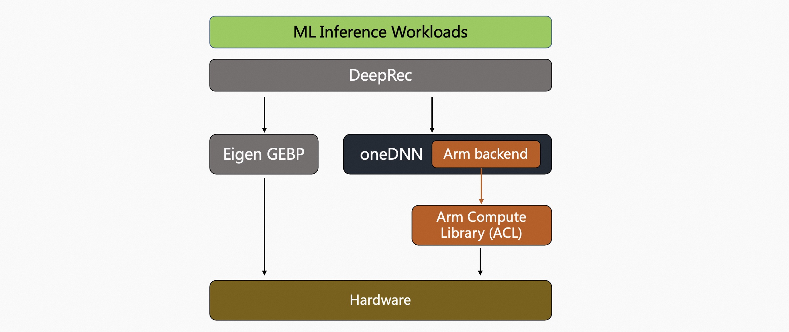

# Arm Compute Library

## 介绍

The [Arm Compute Library](https://github.com/ARM-software/ComputeLibrary) (ACL) 是 ARM 公司开源的一个高性能计算库，旨在优化基于ARM架构的处理器上的计算密集型任务。它提供了一系列的计算函数和算法，包括了许多现代机器学习算法的实现，可以用于深度学习等领域的任务。通过 [文档](https://arm-software.github.io/ComputeLibrary/latest/index.xhtml) 可以了解 ACL 支持的计算原语。

当前，DeepRec 已经加入了 ACL 支持，只需在 DeepRec 编译命令中加入关于 ACL 的编译选项：`--config=mkl_aarch64` 即可开启 ACL 加速算子计算。

DeepRec 上集成 ACL 的方式是通过 oneDNN 作为中间调用层完成的，他们的关系如下图：


通过 oneDNN 的宏也能控制 ACL 的行为，例如，用户可以在支持 bf16 的设备上启用低精度推理加速：
```bash
ONEDNN_DEFAULT_FPMATH_MODE=BF16 python foo.py
```
指定环境变量 `ONEDNN_DEFAULT_FPMATH_MODE=BF16`，ACL 会自动判断硬件设备是否支持 BF16 矩阵乘法指令，如果支持，则将 FP32 矩阵乘法换成BF16实现。

