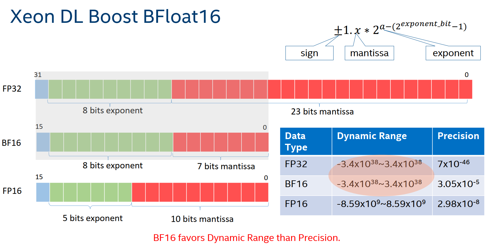

# BFloat16

BFloat16(BF16)，是第三代英特尔® 至强® 可扩展处理器 Cooper Lake [阿里云hfg7规格族](https://help.aliyun.com/document_detail/25378.html?spm=5176.2020520101.vmBInfo.instanceType.4a944df5PvCcED#hfg7) 及其后续处理器上支持的一种计算格式和指令，用于加速深度学习的训练和推理。其与其他常用数据格式的比较：



## 使用条件与方法

使用条件：云实例要求第三代英特尔® 至强® 可扩展处理器 Cooper Lake [阿里云hfg7规格族](https://help.aliyun.com/document_detail/25378.html?spm=5176.2020520101.vmBInfo.instanceType.4a944df5PvCcED#hfg7)，并且需要采用 oneDNN 编译优化的 DeepRec，才能提供 BF16 指令加速，具体编译可以在 oneDNN 章节了解详情。

使用方法：由于推荐场景对模型精度的要求极其严苛，所以为了提升模型性能的同时，兼顾模型精度，用户可以通过以下方式，自由控制 BF16 计算图。

- 步骤 1：在 `tf.variable_scope(…)` 之后添加 `.keep_weights(dtype=tf.float32)`，用于保持当前权重为 FP32 类型；

- 步骤 2：添加 `tf.cast(…, dtype=tf.bfloat16)` 将 inputs tensor 转换为 BF16 类型；

- 步骤 3：添加 `tf.cast(…, dtype=tf.float32)` 将 outputs tensor 转换为 FP32 类型。

```
with tf.variable_scope(…).keep_weights(dtype=tf.float32):
  inputs_bf16 = tf.cast(inputs, dtype=tf.bfloat16)
  … // BF16 graph, FP32 weights
  outputs = tf.cast(outputs_bf16, dtype=tf.float32)
```

代码示例：
```
import tensorflow as tf

inputs = tf.ones([4, 8], tf.float32)

with tf.variable_scope('dnn', reuse=tf.AUTO_REUSE).keep_weights(dtype=tf.float32):
  # cast inputs to BF16
  inputs = tf.cast(inputs, dtype=tf.bfloat16)
  outputs = tf.layers.dense(inputs, units=8, activation=tf.nn.relu)
  outputs = tf.layers.dense(inputs, units=1, activation=None)
  # cast ouputs to FP32
  outputs = tf.cast(outputs, dtype=tf.float32)

  outputs = tf.nn.softmax(outputs)

with tf.Session() as sess:
  sess.run(tf.global_variables_initializer())
  print(sess.run(outputs))
```

特别提醒：依据调参经验，通常在多层DNN 网络中最后一层DNN网络，对模型的精度影响最大，并且计算比重较低，所以可以将最后一层DNN网络转换成 FP32 类型运行，既可以提升模型计算速度，又能保留模型精度。

为了与 BF16 量化前的模型精度保持一致，DeepRec 在 variable_scope 中提供了 `keep_weights(dtype=dtypes.float32)` 方法，使用该方法后，该变量域中所有变量将会以 FP32 的格式保存，可以显著减少变量的累计求和误差。并且在图中自动添加 cast 操作，将其转换为 BF16 格式进行计算。由于引入的 cast 操作会带来额外的计算开销，为了减小这部分开销，DeepRec 会自动将 cast 算子和就近的算子进行融合，提高运行速度。
DeepRec将进行下列 cast 相关算子的融合操作：
- MatMul + Cast
- Concat + Cast
- Split + Cast

## 性能对比

使用 DeepRec Modelzoo 中模型，对比 DeepRec 开启 BF16 后对比 FP32 的性能提升。Modelzoo 中模型通过添加 `--bf16` 参数启用 BF16 特性。

测试机器使用阿里云 ECS 云服务器，Intel Xeon Cooper Lake CPU，规格为 [ecs.hfg7.2xlarge](https://help.aliyun.com/document_detail/25378.html?spm=5176.2020520101.vmBInfo.instanceType.4a944df5PvCcED#hfg7)

- 硬件配置：
  - Intel(R) Xeon(R) Platinum 8369HC CPU @ 3.30GHz
  - CPU(s): 8
  - Socket(s): 1
  - Core(s) per socket: 4
  - Thread(s) per core: 2
  - Memory: 32G
- 软件配置：
  - kernel: 4.18.0-348.2.1.el8_5.x86_64
  - OS: CentOS Linux release 8.5.2111
  - GCC: 8.5.0
  - Docker: 20.10.12
  - Python: 3.6.8

性能结果：
| **Throughput** | **WDL**  | **DeepFM** | **DSSM**  |
|----------------|----------|------------|-----------|
| FP32           | 15792.49 | 30718.6    | 114436.87 |
| FP32+BF16      | 22633.8  | 34554.67   | 125995.83 |
| Speedup        | 1.43x    | 1.12x      | 1.10x     |

BF16 对模型训练的 AUC 结果影响很小，具体细节可以从 Modelzoo 中的每个模型的说明文档中找到差异。

