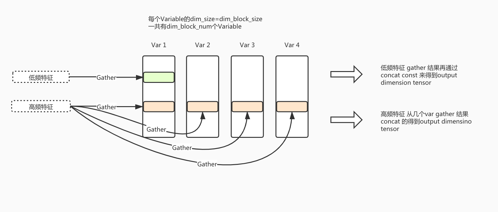

# Dynamic-dimension Embedding Variable
## 背景
在典型的推荐场景中，同类特征的出现频次往往**极度不均匀**，以商品的id item_id 这个特征为例，前3%的item_id, 占据了80%的曝光，前20%的item_id,占据了98%的曝光。目前，所有特征的Embeding都会被设定成统一维度，如果Embedding维度过高，低频特征容易过拟合，而且会额外耗费大量内存；如果维度设置过低，那么高频部征特征可能会由于表达不够而欠拟合，最终的效果因此而大打折扣。
​

Dynamic Dimension EmbeddingVariable功能依据特征的频度来给Embedding动态分配维度；高频高维度，低频低维度； 高频特征可以被给到很高的维度而不担心欠拟合问题， 而低频特征因为给定低维度embedding，一定程度上起到了正则的作用，既缓解了过拟合的问题，而且可以极大程度节省内存(低频长尾特征的数量占据绝对优势)
​



<center>Dynamic-dimension Embedding Variable示例图</center>

## 用户接口
下面是使用dynamic-dimension embedding variable接口的用户接口，目前提供了两种接口：
第一个是底层API `get_dynamic_dimension_embedding_variable`:

```python
def get_dynamic_dimension_embedding_variable(
    name,
    embedding_block_dimension, # 表示单元EV的dimension
    embedding_block_num, # 新增，表示单元EV的数目 
    key_dtype=dtypes.int64,
    value_dtype=None,
    initializer=None,
    regularizer=None,
    trainable=True,
    collections=None,
    caching_device=None,
    partitioner=None,
    validate_shape=True,
    custom_getter=None,
    constraint=None,
    steps_to_live=None,
    steps_to_live_l2reg=None,
    l2reg_theta=None
)
```
另一个是利用`sparse_column_with_dynamic_dimension_embedding`:
```python
def sparse_column_with_dynamice_dimension_embedding(
    column_name, dtype=dtypes.string, partition_num=None, steps_to_live=None,
    embedding_block_dimension, # 表示单元EV的dimension
    embedding_block_num, # 新增，表示单元EV的数目
)
```
dynamic dimension embedding variable的大部分参数都和get_embedding_variable相同，下面解释dynamic dimension embedding variable中主要的参数：

- `embedding_block_dimension`: 每一个block的维度
- `embedding_block_num`: 一个特征的embedding最多可以有多少个block

对于一个dynamic-dimension embedding variable，他的Embedding的最大size就是`embedding_block_dimension * embedding_block_num`。
​

当使用dynamic dimension embedding variable的时候，在embedding_lookup的时候需要传入`blocknum`上参数，用来指示每一个特征对应的blocknum
```python
'''
blocknums: 新加参数，是一个和ids一一对应的tensor，代表每个id需要去几个fae的ev blocks中去找
example:
创建了一个dynamic embedding variable, 
其中embedding_block_dimension=6, 
embedding_block_num=4

ids=[21,34,78,99,56],blocknums=[4, 1, 4, 3, 1]

那么embedding_lookup的结果就是：（1是embedding的学习结果，0为补齐）
[[1. 1. 1. 1. 1. 1. 1. 1. 1. 1. 1. 1. 1. 1. 1. 1. 1. 1. 1. 1. 1. 1. 1. 1.]
 [1. 1. 1. 1. 1. 1. 0. 0. 0. 0. 0. 0. 0. 0. 0. 0. 0. 0. 0. 0. 0. 0. 0. 0.]
 [1. 1. 1. 1. 1. 1. 1. 1. 1. 1. 1. 1. 1. 1. 1. 1. 1. 1. 1. 1. 1. 1. 1. 1.]
 [1. 1. 1. 1. 1. 1. 1. 1. 1. 1. 1. 1. 1. 1. 1. 1. 1. 1. 0. 0. 0. 0. 0. 0.]
 [1. 1. 1. 1. 1. 1. 0. 0. 0. 0. 0. 0. 0. 0. 0. 0. 0. 0. 0. 0. 0. 0. 0. 0.]]
'''
def embedding_lookup(
    params,
    ids,
    partition_strategy="mod",
    name=None,
    blocknums=None    
)
```
## 使用示例
### 动态维度调整策略

对于每一个特征有两个统计量，分别是累积特征频次freq_acc以及特征在当前时段的出现速度freq_current_speed，freq_acc和freq_current_speed都会被初始化为0，freq_acc平时不更新，会在特定的step根据一定的规则进行更新，而freq_current_speed则会随着特征被访问而更新，特征每被访问一次freq_current_speed就会+1，然后会在特定的step被置为0。
目前使用的更新freq_acc的规则如下：
$freq\_acc = \beta*freq\_acc + (1.0-\beta)*freq\_current\_speed$, 其中 $0\le\beta\le1$，$\beta$可以设置为0.9。
​

在获得每个特征的blocknum时，首先根据freq_acc和freq_current_speed计算每个特征对应的freq，公式如下：


$freq=\frac{\beta*freq\_acc + (1.0-\beta)*freq\_current\_speed}{(1.0-\beta^t)}$ ， t是freq_acc被reset的次数


在得到每一个特征的freq后，需要计算不同的blocknum数量对应的阈值：具体步骤如下：

1. 对所有freq_acc超过一个阈值的特征进行ranking（该阈值可以设置为0.000001），超过阈值的特征的数量记为total_rank。
1. 考虑到推荐场景中的特征频次分布符合幂律分布，我们给出一个指数分布来划分阈值空间，即给出一个p，得到一个$[p^0,p^1,....,p^{n+1}]$，其中$1<p$，n是blocknum的数量。
1. 对于每一个$k\in[1,....,n+1]$，计算$rank =(p^{n+1-k}-p^0)/(p^{n+1}-p^0) * total\_rank$，然后根据freq_acc选出top-rank个freq_acc, 这之中的最小值即是第i个block对应的阈值。
1. 对于每一个特征，将freq与阈值比较即可决定每个对应的embedding的长度。


