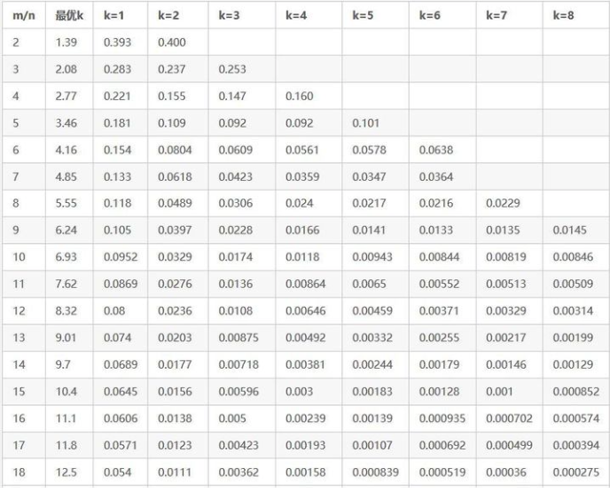

# EmbeddingVariable进阶功能：特征准入
## 功能介绍
通过观察发现，当有些特征的频率过低时，对模型的训练效果不会有帮助，还会造成内存浪费以及过拟合的问题。因此需要特征准入功能来过滤掉频率过低的特征。
目前我们支持了两种特征准入的方式：基于Counter的特征准入和基于Bloom Filter的特征准入：

- **基于Counter的特征准入**：基于Counter的准入会记录每个特征在前向中被访问的次数，只有当统计的次出超过准入值的特征才会给分配embedding vector并且在后向中被更新。这种方法的好处子在于会精确的统计每个特征的次数，同时获取频次的查询可以跟查询embedding vector同时完成，因此相比不使用特征准入的时候几乎不会带来额外的时间开销。缺点则是为了减少查询的次数，即使对于不准入的特征，也需要记录对应特征所有的metadata，在准入比例较低的时候相比使用Bloom Filter的方法会有较多额外内存开销。
- **基于Bloom Filter的准入**：基于Bloom Filter的准入是基于Counter Bloom Filter实现的，这种方法的优点是在准入比例较低的情况下，可以比较大地减少内存的使用量。缺点是由于需要多次hash与查询，会带来比较明显的时间开销，同时在准入比例较高的情况下，Blomm filter数据结构带来的内存开销也比较大。
- **未准入特征初始化**：当用户开启准入功能，特征尚未达到准入条件，此时查询到Embedding值为InitializerOption中设置的default_value_no_permission，默认值为0.0。

## 使用方法

用户可以参考下面的方法使用特征准入功能

```python
#使用CBF-based feature filter
filter_option = tf.CBFFilter(filter_freq=3,
                                         max_element_size = 2**30,
                                         false_positive_probability = 0.01,
                                         counter_type=dtypes.int64)
#使用Counter-based feature filter
filter_option = tf.CounterFilter(filter_freq=3)

ev_opt = tf.EmbeddingVariableOption(filter_option=filter_option)
#通过get_embedding_variable接口使用
emb_var = get_embedding_variable("var", embedding_dim = 16, ev_option=ev_opt)

#通过sparse_column_with_embedding接口使用
from tensorflow.contrib.layers.python.layers import feature_column
emb_var = feature_column.sparse_column_wth_embedding("var", ev_option=ev_opt)

emb_var = tf.feature_column.categorical_column_with_embedding("var", ev_option=ev_opt)
```
下面是特征准入接口的定义：
```python
@tf_export(v1=["CounterFilter"])
class CounterFilter(object):
  def __init__(self, filter_freq = 0):
    self.filter_freq = filter_freq
    
@tf_export(v1=["CBFFilter"])
class CBFFilter(object):
  def __init__(self,
               filter_freq = 0,
               max_element_size = 0,
               false_positive_probability = -1.0,
               counter_type = dtypes.uint64)
```
**参数解释**：

- `filter_freq`：这个参数两种filter都有，表示特征的准入值。
- `max_element_size`：特征的数量
- `false_positive_probability`：允许的错误率
- `counter_type`：统计频次的数据类型

BloomFilter的准入参数设置可以参考下面的表，其中m是`bloom filter`的长度，n是`max_element_size`, k是`hash function`的数量，表中的数值是`false_positive_probability`：



**功能的开关**：如果构造`EmbeddingVariableOption`对象的时候，如果不传入`CounterFilterStrategy`或`BloomFilterStrategy`或`filter_freq`设置为0则功能关闭。

**ckpt相关**：对于checkpoint功能，当使用`tf.train.saver`时，无论特征是否准入，都会将其id与频次信息记录在ckpt中，未准入特征的embedding值则不会被保存到ckpt中。在load checkpoint的时候，对于ckpt中未准入的特征，通过比较其频次与filter阈值大小来确定在新一轮训练中是否准入；对于ckpt中已经准入的特征，无论ckpt中的特征频次是否超过了filter阈值，都认为其在新一轮训练中是已经准入的特征。同时ckpt支持向前兼容，即可以读取没有conuter记录的ckpt。目前不支持incremental ckpt。

**关于filter_freq的设置**：目前还需要用户自己根据数据配置。

**特征准入与Embedding多级存储**：由于基于BloomFilter的特征准入功能与Embedding多级存储功能基于不同的计数组件统计特征的频次，同时打开两个功能将导致计数功能出现错误，因此目前无法同时使用基于BloomFilter的特征准入与Embedding多级存储功能。

**收集未准入特征的信息**：

用户如果想要获取一些未准入特征的信息，例如有哪些特征未准入，他们的被访问频次分别是多少，用户可以通过读取ckpt中的内容来获得这些信息。读取checkpoint中内容的方法如下：
```python
from tensorflow.contrib.framework.python.framework import checkpoint_utils
for name, shape in checkpoint_utils.list_variables("xxxxx.ckpt"):
      print('loading... ', name, shape, checkpoint_utils.load_variable("xxxxx.ckpt", name))
```

执行上述代码可以得到如下结果：

对于EV，在存入ckpt时会被分成9个部分保存，假设EV的名字是var，那么将在ckpt中看到：

- `var-keys`:已准入特征的id
- `var-values`:已准入特征的embedding
- `var-freqs`:已准入特征被查询的次数
- `var-versions`:已准入特征最近一次被更新的global step
- `var-keys_filtered`:未准入特征的id
- `var-freqs_filtered`:未准入特征被查询的频次
- `var-versions_filtered`:未准入特征最近一次被更新的global step
- `var-partition_offset`:用于恢复已准入特征的参数
- `var-partition_filter_offset`:用于恢复未准入特征的参数

用户通过读取filtered相关的参数就可以收集未准入特征的信息。
