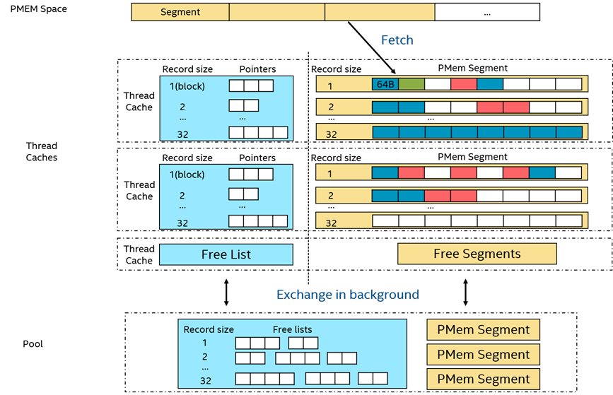

# PMEM
## PMEM介绍
英特尔® 傲腾™ 持久内存（简称PMEM，https://www.intel.cn/content/www/cn/zh/architecture-and-technology/optane-dc-persistent-memory.html ）是一种颠覆性的技术，它在内存和存储器之间创建了一个新的层级。在存储分层结构中，利用局部性原理，将经常访问的数据保持在最靠近 CPU 的位置，易失性DRAM速度快，但容量有限，价格昂贵；非易失性存储（如NAND SSD）容量更大，价格较便宜，但是数据读取速度较慢。存储介质很容易成为应用程序性能的瓶颈，在这种背景下，PMEM作为一种新的存储介质，给了我们一个新的选择，它在存储的分层结构中占据DRAM之下SSD之上，它具有如下的特点：
1. 比DRAM大，比SSD快，能够提供单条最大512G的容量，访问延迟在几百ns，比SSD快2个数量级；
2. 非易失；
3. 支持两种模式：
   - 内存模式：提供大容量内存，性能接近DRAM，CPU 内存控制器将PMEM视为易失性系统内存，把DRAM作为PMEM的缓存；
   - 应用直接访问模式：将PMEM当成一个持久化设备来使用，它是字节可寻址持久性内存，可以使用文件系统比如XFS和EXT4，或者使用PMDK来管理PMEM。

为什么PMEM既能持久化存储，又比SSD快呢？其一是PMEM直接插在内存插槽上，通过DDR-T协议，与CPU进行数据交互；其二是底层的用于表示二进制0和1的状态是持久的，即非易失的。根据官网给出的性能指标，以单条128GB为例，写入单元为256B时，能够达到7.45GB/s的读带宽，2.25GB/s的写带宽。

## 数据存到PMEM的方式
### 内存模式
这是一种最快速、低成本扩展内存容量的方式，对于程序完全透明。在这种模式下，DRAM内存表现为持久内存在直接映射缓存策略下的可写回缓存，此时的持久内存作为大容量易失性内存暴露给操作系统和最终用户使用。这种模式的最大优势是兼容性好，整个的DRAM cache层是在硬件的MMU中实现的，操作系统自身完全不需要知道自己是运行在什么种类的内存之上的，所以所有的应用都不需要任何修改，就可以享受PMEM带来的超大系统容量的好处。
一般来说，适用于内存模式的应用程序应该拥有较好的DRAM内存缓存命中率。其内存访问的分布可以大于DRAM内存的容量，但其热点的工作集应该小于DRAM内存的容量，即所谓拥有较好的数据本地性。  
  
图1  内存模式下的缓存命中原理
### 应用直接访问模式
相比于内存模式，应用直接访问模式则可以利用PMEM的持久化特性，但是就需要操作系统和软件的支持了，Linux内核是从4.2版本开始引入了对SNIA NVDIMM的支持。在应用直接访问模式下，PMEM和与其相邻的DRAM内存都会被识别为可按字节寻址的内存。
应用直接访问模式下，操作系统可以将PMEM硬件作为两种不同的设备来使用，一种是FSDAX模式，PMEM被配置成块设备，用户可以将其格式化成一个文件系统，然后使用。并且如果使用xfs或者ext4文件系统时，还可以在挂载时使用dax参数，激活文件系统的dax mode，使得应用程序可以跳过kernel page cache来直接读写PMEM上的数据。
另一种是DEVDAX模式，PMEM被驱动为单个字符设备，在高版本的内核（5.1 以上）支持下，依赖Kernel提供的KMEM DAX特性，把持久内存作为易失性内存使用，将持久内存接入内存管理系统，从系统中可以将持久内存作为一个和DRAM相类似的匿名空间，将持久内存看作是一个较慢，较大的内存NUMA节点，应用可透明访问持久内存。
#### 基于FSDAX的PMEM allocator
基于PMDK的底层libpmem库（https://pmem.io/pmdk/libpmem/） 实现的PMEM allocator从PMEM map出的一块空间，分为若干segment，每个segment又分成若干blocks，block是allocator的最小分配单元。前台分配block的线程为避免线程竞争，缓存一些可用空间，包括一组segment和free list。可用空间中为每种record size（若干个block）维护一个free list和segment。各record size对应的segment只分配该大小的PMEM空间，各record size对应的free list中的所有指针均指向对应record size的空闲空间。此外，为了均衡各thread cache的资源，由一个后台线程周期地将thread cache中的free list移动到后台的pool中，pool中的资源由所有前台线程共享。  
  
图2  基于FSDAX的PMEM allocator架构
#### 基于KMEM DAX的PMEM allocator
Linux kernel >= 5.1以后支持的KMEM DAX特性可以将持久内存作为易失性内存使用，持久内存会被视为独立的仅有内存的NUMA节点，这样从系统中可以将持久内存作为一个和DRAM相类似的匿名空间，交由MMU统一管理，这里可以把持久内存看作是一个较慢、较大的内存节点，应用程序可以完全透明地访问持久内存和DRAM。Memkind（https://github.com/memkind/memkind） API 已扩展为允许从这些持久内存对应的NUMA 节点上分配内存。Memkind是用户可扩展堆管理器，构建在jemalloc之上，它可以控制各种内存之间的堆分区。  
  
图3  基于KMEM DAX的NUMA节点架构  
  
图4  使用Memkind从配置成NUMA节点的持久内存分配内存

