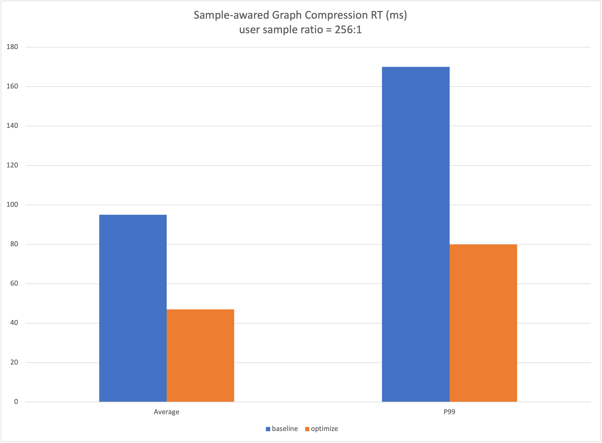

# 样本感知的图压缩
## 背景
在典型的推荐场景的排序模型中，样本的构成往往是<用户, 商品>，并且是一对多的组成形式。有以下特点：
### 样本特点
样本作为模型训练的源端，决定了模型的组成，影响了模型的计算。在推荐场景中，一次页面的曝光生产的若干样本，样本的共性为user为同一个，即

```
user_1_feature, item_1_feature, label_1
user_1_feature, item_2_feature, label_2
... ...
user_1_feature, item_N_feature, label_N
```

这导致在样本的存储存在冗余，浪费了存储/传输空间，表达了无效信息量。
### 模型特点
在这样的样本特点下，读入的冗余样本必然也衍生了计算冗余，针对上面的样本，训练模型的时候，batch内部，user_1_feature会重复的run sub-graph（如：Attention Graph）若干次。这部分计算是完全冗余的，可以在运行时节省掉，只计算一次。
## 功能
在训练和推理场景中，利用样本以及模型的特征，在用户无需对Graph做修改的前提下，对接用户准备好的压缩后样本，自动进行图优化，提高训练和推理的性能。
### 训练 & 推理
在用户构造训练/推理图之前，调用python API 打开该功能，自动进行图优化
## API
```
tf.graph_optimizer.enable_sample_awared_graph_compression(user_tensors,
                                                          item_tensors,
                                                          item_size)
Args:
    user_tensors: user侧样本
    item_tensors: 非user侧样本
    item_size: item数目
```
## 代码示例
### Training
TODO
### Inference

```
USER_FEATURE = ['user_feature_0', 'user_feature_1']
ITEM_FEATURE = ['item_feature_0', 'item_feature_1']
ALL_FEATURE = USER_FEATURE + ITEM_FEATURE

def serving_input_receiver_fn():
  item_size = tf.placeholder(dtype=tf.int32, shape=[None], name='item_size')
  features = {}
  inputs = {"item_size": item_size}
  user_tensors = []
  item_tensors = []
  for fea_name in ALL_FEATURE:
    features[fea_name] = tf.placeholder(tf.string, [None], name=fea_name)
    inputs[fea_name] = features[fea_name]
    if fea_name in ITEM_FEATURE:
      item_tensors.append(features[fea_name])
    else:
      user_tensors.append(features[fea_name])

    """Enable Sample-awared Graph Compression"""
    tf.graph_optimizer.enable_sample_awared_graph_compression(
        user_tensors,
        item_tensors,
        item_size)

  return tf.estimator.export.ServingInputReceiver(features, inputs)

estiamtor = ...
estiamtor.export_savedmodel(output_dir, serving_input_receiver_fn)
```
1. 需要同时使用 DeepRec 提供的[estimator](https://github.com/AlibabaPAI/estimator)

2. 输入数据格式
一般在inference场景下，输入数据为protobuf，protobuf中包含模型所需各个特征的值以及指示该样本中item数目的tensor, user tensor shape为[Duser], item tensor shape为[N, Ditem]

## 性能
该功能，将user侧特征进行压缩，减少了Inference端到端时延，在某云上业务线上服务中，性能结果如下：


